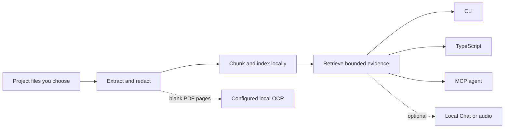
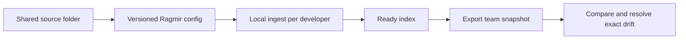

# Ragmir

[](https://www.npmjs.com/package/@jcode.labs/ragmir)
[](https://www.npmjs.com/package/@jcode.labs/ragmir)
[](https://github.com/jcode-works/jcode-ragmir/actions/workflows/ci.yml)
[](https://www.npmjs.com/package/@jcode.labs/ragmir)
[](./LICENSE)

**Confidential local RAG for coding agents, scripts, and Node.js applications.**

Ragmir turns specifications, Word files, PDFs, spreadsheets, code, and local exports into cited
evidence indexed and retrieved on your machine. Core works offline by default, never uploads your
corpus, and calls no model. Connect the agent or automation you already use through CLI, MCP, or a
typed TypeScript API, or keep the complete workflow local with the optional Chat package.

[Website](https://ragmir.com) · [npm](https://www.npmjs.com/package/@jcode.labs/ragmir) ·
[Documentation](https://github.com/jcode-works/jcode-ragmir/wiki) ·
[CLI](./docs/cli-reference.md) · [API](./docs/api-reference.md) ·
[Releases](https://github.com/jcode-works/jcode-ragmir/releases)

## Start in 60 seconds

The fastest path is to let your coding agent inspect the repository and tailor the setup.

<!-- ragmir-setup-prompt:start -->
<details>
<summary><strong>Option 1: paste this into your coding agent</strong></summary>

~~~text
Set up Ragmir in this repository. Work interactively: inspect first, ask one concise numbered batch of questions, wait for my answers, then execute. Never assume consent for dependency changes, model downloads, replacing skills, or sharing data.

Outcome: Core installed with the repository's package manager; useful sources selected; secrets and generated noise excluded; tools connected; cited retrieval verified. Semantic retrieval, team features, Chat, and TTS are optional.

1. Inspect without changes:
- Find the repository or monorepo root. Read package.json packageManager, lockfiles, workspace and Node/version-manager files, .gitignore, existing .ragmir state, README, AGENTS/CLAUDE/CODEX guidance, docs, specs/ADRs, apps/packages, important config, source, and tests.
- Detect Node 22+ and pnpm, npm, Yarn, or Bun. Prefer packageManager, then the lockfile. Respect workspace-root flags and mise/asdf/Volta. Never create a second lockfile. If signals conflict, ask.
- If Ragmir exists, inspect its version, config, status, sources, and rgr upgrade --check before changing it.

2. Ask only what the repository did not answer, then wait:
1) Which repository/monorepo base should own the knowledge base, and are nested app bases wanted?
2) Which clients: Claude Code, Codex, Kimi, OpenCode, Cline, another MCP client, or none?
3) Keep default offline local-hash, or allow one semantic-model download for better natural-language retrieval?
4) Solo or team use? If team, what Git/Drive/folder revision is authoritative and who may receive metadata-only snapshots?
5) Core only, or optional Chat? For Chat choose lite (~0.49 GB), fast (~3.35 GB), or quality (~5.15 GB).
6) Optional TTS? Ask language (en/fr/es offline; ja/th/zh require explicit Edge unless a local model is supplied) and whether text may reach Edge.
7) Which private/external folders are allowed, which must never be indexed, and may I install packages, edit local config, and run approved downloads now?

3. Implement after approval:
- Install @jcode.labs/ragmir as a dev dependency with the detected manager. Install Chat/TTS only if selected, at a compatible version.
- Run the matching rgr setup --no-ingest --agents <selected> command. Keep project scope. If a same-name skill is unmanaged, show the diff and ask before --force.
- Build a narrow .ragmir/config.json. Prefer stable relative globs for root guidance, docs/specs/ADRs, package READMEs/manifests, useful app config, and source/tests that explain behavior. Include locales only when useful.
- Exclude .env*, credentials, keys, unapproved dumps/customer data, dependencies, generated/build/cache/coverage/log folders, vendored code, binaries/media, and .ragmir storage/models. In monorepos, keep nested bases scoped and shared knowledge at root.
- Run preview and audit --unsupported before ingest. Review redactions, unsupported/oversized files, duplicates, chunks, and sensitive paths. Fix config first, then ingest.
- For an existing install, use rgr upgrade and doctor --fix as indicated. Never delete the active index first. Rebuild only for incompatible embedding, chunk, or index-policy changes.
- Enable semantic retrieval, preload Chat, or preload TTS only after consent. Use non-sensitive TTS preload text.
- For teams, ingest locally, create an ignored metadata-only snapshot, compare it, explain every drift, and never choose authority automatically.

4. Prove the result:
- Run rgr doctor --deep, rgr audit --unsupported, and rgr security-audit.
- Run representative searches with citations and --explain. Create a small local golden suite for project questions and run rgr evaluate; do not weaken gates to pass.
- Report detected tools, answers, packages, downloads, config/sources/exclusions, changed files, readiness, retrieval results, team status, and exact remaining actions.

Never commit .ragmir, corpus files, models, snapshots, logs, or secrets. Never claim offline, semantic, team synchronization, or retrieval quality without evidence.
~~~

</details>
<!-- ragmir-setup-prompt:end -->

Prefer manual setup? Ragmir requires Node.js 22 or later. Install it in the project that owns the files to search:

```bash
pnpm add -D @jcode.labs/ragmir
pnpm exec rgr setup --agents codex,claude,kimi,opencode,cline
pnpm exec rgr sources add "README.md" "docs/**/*.md"
pnpm exec rgr ingest
pnpm exec rgr search "Which decision changed the rollout?"
```

Using npm? Replace `pnpm add -D` with `npm install --save-dev` and `pnpm exec` with `npx`. At a
pnpm workspace root, use `pnpm add -Dw`.

`rgr setup` creates ignored local state under `.ragmir/` and connects the selected agents. Ingestion
is incremental and resumable, so running the same command again continues from durable progress.
Use `rgr doctor` to confirm readiness, then ask an agent:

```text
Use Ragmir to find which decision changed the rollout. Cite every claim and expand the strongest
citation before proposing an edit.
```

## Why Ragmir

| Strength | What it gives you |
| --- | --- |
| Local by default | Corpus, index, reports, and metadata-only logs stay under ignored `.ragmir/` state |
| Verifiable evidence | File and chunk references, source lines, PDF pages, PPTX slides, XLSX cells, and EPUB positions when the format supports them |
| Model-agnostic Core | Cited retrieval for any compatible agent, script, CLI, MCP client, or TypeScript application |
| Production-grade ingestion | Bounded memory and concurrency, per-file durable progress, atomic rebuild activation, and local writer serialization |
| Inspectable retrieval | Hybrid ranking explanations, explicit evidence thresholds, stable tie-breaks, and exact vector diagnostics |
| Open source | MIT-licensed packages, a static telemetry-free website, and no hosted Ragmir account |

The default `local-hash` provider needs no model download and does not load Transformers.js, ONNX
Runtime, or Sharp. Semantic Transformers.js embeddings are an explicit option. Below 100,000 rows,
vector search remains exhaustive; larger tables use a quality-gated IVF-PQ policy with complete
coverage. Separate bounded queues protect search, embedding, and ingestion from unbounded work.

The repository includes deterministic citation, retrieval-quality, scale, storage, parser,
observability, startup, and runtime benchmarks. See the [benchmark guide](./packages/ragmir-core/benchmarks/README.md)
for claim-eligible runs and comparison rules.

## How it works



Project paths resolve from the caller's working directory or explicit configuration, never from the
installed package. Ragmir opens no HTTP port. A network-facing application owns transport security,
authentication, authorization, and rate limits.

## Choose an interface

| Interface | Best for | Result |
| --- | --- | --- |
| `rgr` CLI | Setup, ingest, search, audit, and maintenance | Human-readable or JSON output |
| TypeScript API | Scripts and long-running Node.js workers | Typed results and explicit lifecycle |
| Local MCP server | Coding agents and compatible clients | Bounded, read-focused retrieval tools |
| Ragmir Chat | Fully local answer generation | Answers grounded in verified cited passages |
| Ragmir TTS | Reviewed text briefs | Local WAV or explicit online MP3 |

Core remains retrieval-first: `ask()` returns cited context, not a generated answer. Chat and TTS
are optional packages loaded only when their commands are used.

## Common workflows

### Agents and monorepos

Generated MCP helpers pin the project root so an agent queries the intended index. In a monorepo,
Ragmir selects the nearest `.ragmir/config.json`; root and package bases stay isolated.

```bash
pnpm exec rgr bases
pnpm exec rgr --project-root apps/web search "checkout contract"
```

Read the [agent integration guide](./docs/agent-integration.md) for native helpers, MCP tools,
resource budgets, and monorepo routing.

### Teams



Teams use Git, Drive, or their existing file workflow to synchronize one source of truth, commit the
same Ragmir source globs and configuration, then build one local index per developer:

```bash
pnpm exec rgr team snapshot --label alice --output .ragmir/team/alice.json
pnpm exec rgr team compare .ragmir/team/alice.json --local-label christophe
```

The comparison names configuration differences plus local-only, peer-only, and changed files, then
gives ordered repair steps. It never guesses which copy is authoritative: the team keeps that
decision in Git, Drive, or its existing source workflow. `ready` means the index can serve and be
compared; privacy warnings are reported as non-blocking security advisories with a separate
`rgr security-audit` action. Existing v2.19 snapshots remain comparable without reindexing.
Detailed safeguards live in the
[team guide](./docs/agent-integration.md#team-knowledge-bases) and
[configuration reference](./docs/configuration.md#stable-team-source-configuration).

### Audit and explain retrieval

```bash
pnpm exec rgr preview --path docs --max-chunks 3
pnpm exec rgr audit --unsupported
pnpm exec rgr security-audit
pnpm exec rgr search "release approval" --explain
pnpm exec rgr research "release obligations" --compact --timeout-ms 10000
```

`preview` inspects redacted chunks without writing an index. `audit` compares sources with indexed
state. `research` combines bounded query variants with deterministic cross-query ranking. Use
`rgr doctor --deep` only when you need a live O(corpus) inventory; normal status and doctor checks
read the compact activation manifest.

### Safe upgrades

```bash
pnpm exec rgr upgrade --check
pnpm exec rgr upgrade
```

Run this after updating the package and before the first retrieval with the new runtime.
`upgrade --check` only explains whether the current index can be reused. `upgrade` refreshes local
agent helpers and stages any required rebuild in a separate generation. It never deletes the active
index first: only a validated replacement activates, and interrupted or failed rebuilds remain
resumable. A long-running host can keep its already loaded runtime serving the previous generation,
then restart or cut over after `status=current` and `ready=true`. Privacy or extractor warnings are
reported separately as `advisory` lines and do not mislabel an operational index as needing repair;
resolve them with `rgr security-audit` without discarding the working index.

### Semantic retrieval and scanned PDFs

```bash
pnpm exec rgr setup --semantic
pnpm exec rgr ingest --rebuild

pnpm exec rgr ocr setup --engine auto
pnpm exec rgr ingest --rebuild
```

Semantic mode uses explicitly prepared local model weights. OCR prefers embedded PDF text and runs
only for blank pages through a configured local executable, with bounded batches and a private
resumable cache. Ragmir has no cloud OCR integration.

## TypeScript API

```ts
import { createRagmirClient, isRagmirError } from "@jcode.labs/ragmir"

const ragmir = await createRagmirClient({ cwd: process.cwd() })
try {
  await ragmir.ingest({ timeoutMs: 120_000 })
  const results = await ragmir.search("Which decision changed the rollout?", {
    topK: 5,
    explain: true,
    timeoutMs: 10_000,
  })

  for (const result of results) console.log(result.citation, result.text)
} catch (error) {
  if (isRagmirError(error)) console.error(error.code, error.retryable)
  else throw error
} finally {
  await ragmir.close()
}
```

Reuse one client per project root in a long-running process and close it during shutdown. One-shot
`ingest`, `search`, `ask`, and `research` functions remain available for short scripts. The
[API reference](./docs/api-reference.md) documents setup, preview, evaluation, privacy, OCR, MCP,
source routing, lifecycle, cancellation, and timeout options.

## Supported content

Ragmir handles source code, text, Markdown, configuration, logs, CSV, JSON, JSONL, YAML, PDF,
DOCX, PPTX, XLSX, OpenDocument, EPUB, HTML, RTF, email, notebooks, and project-configured text
extensions. Run `rgr audit --unsupported` for the exact files skipped and why. Ragmir does not
claim universal binary support.

## Privacy boundaries

| Capability | Default | Explicit network boundary |
| --- | --- | --- |
| Core retrieval | Local files, index, and `local-hash` retrieval | None required |
| Preferred agent or automation | Receives only passages selected by the integration | The consumer's data policy applies |
| Semantic embeddings | Disabled | Model download is explicit; inference can then stay local |
| OCR | Disabled | Local executable only |
| Ragmir Chat | Optional local GGUF inference | Selected profile is downloaded and verified during setup |
| Ragmir TTS | Optional local WAV | Edge MP3 sends narration text only when explicitly selected |

Redaction reduces accidental exposure but is not a compliance certification. Review
[security hardening](./SECURITY-HARDENING.md) before indexing sensitive material.

## Packages

| Package | Purpose |
| --- | --- |
| [`@jcode.labs/ragmir`](./packages/ragmir-core/README.md) | Core CLI, TypeScript API, MCP server, OCR, and agent helpers |
| [`@jcode.labs/ragmir-chat`](./packages/ragmir-chat/README.md) | Optional cited local answer generation |
| [`@jcode.labs/ragmir-tts`](./packages/ragmir-tts/README.md) | Optional local audio and explicit online speech |

Installing Core does not install Chat or TTS.

## Examples and documentation

| Resource | Use it for |
| --- | --- |
| [Quick start](./docs/quick-start.md) | Agent-guided or manual repository setup |
| [Confidential local RAG demo](./packages/ragmir-core/examples/sovereign-rag-demo/README.md) | Complete fictional CLI workflow |
| [Library API demo](./packages/ragmir-core/examples/library-api-demo/README.md) | Persistent TypeScript client pattern |
| [Document evidence benchmark](./packages/ragmir-core/examples/document-evidence-benchmark/README.md) | Exact path, line, chunk, and PDF-page expectations |
| [CLI reference](./docs/cli-reference.md) | Commands, options, and JSON output |
| [Configuration](./docs/configuration.md) | Sources, privacy, workloads, embeddings, and extractors |
| [Agent integration](./docs/agent-integration.md) | Native helpers, MCP, monorepos, and teams |
| [Troubleshooting](./docs/troubleshooting.md) | Readiness, weak search, OCR, and add-on diagnostics |
| [Release history](https://github.com/jcode-works/jcode-ragmir/releases) | Curated highlights, verification, artifacts, and upgrade links |

Every committed example uses fictional data. Keep private corpora and generated reports outside Git
or under ignored local state.

## Quality and compatibility

Releases are gated on Node.js 22 for Linux x64 and macOS ARM64. `pnpm validate` runs formatting and
lint, dependency audit, type checks, coverage, builds, public API and MCP smoke tests, package
validation, semantic-release checks, and signed release-artifact generation. CI adds the portable
offline installation matrix and CodeQL analysis.

See [CONTRIBUTING.md](./CONTRIBUTING.md), [RELEASING.md](./RELEASING.md), and the
[MIT License](./LICENSE).
