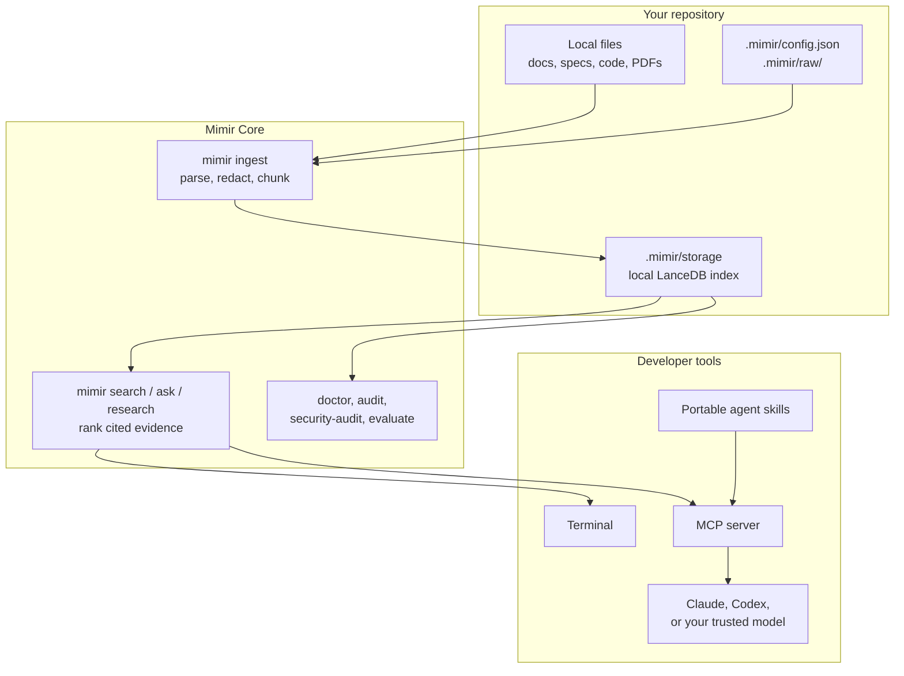

# Mimir

[](https://github.com/jcode-works/jcode-mimir/actions/workflows/ci.yml)
[](https://github.com/jcode-works/jcode-mimir/actions/workflows/codeql.yml)
[](https://www.npmjs.com/package/@jcode.labs/mimir)
[](https://www.npmjs.com/package/@jcode.labs/mimir)
[](https://github.com/jcode-works/jcode-mimir/blob/main/LICENSE)

Open-source, sovereign local RAG for confidential datasets and AI agents.

Mimir provides a TypeScript CLI, library, MCP server, and portable agent skills that can be
installed in any Node.js repository. It indexes local files from the target repository, stores
vectors locally with LanceDB, and can use either built-in local-hash retrieval or optional
Transformers.js semantic embeddings.

Mimir Core returns cited retrieval context. Answer synthesis belongs to the AI agent, LLM, or local
model runtime you choose around it.

Created by Jean-Baptiste Thery and published under the JCode Labs npm scope.

Built by Jean-Baptiste Thery, freelance full-stack/AI tooling engineer at JCode Labs.

## Developer Use Cases

Mimir is designed for agent-assisted development when the useful context is local, private, and
spread across repositories, specifications, exports, and synced folders.

| Use case | What it enables |
| --- | --- |
| Index a repository's documentation | Ask Claude Code, Codex, Kimi Code CLI, OpenCode, Cline, or another agent to implement features from local README files, architecture notes, API contracts, ADRs, and runbooks. |
| Code from a specification or `cahier des charges` | Turn a local PRD, tender response, client brief, or engineering spec into an implementation plan, acceptance checklist, and cited change guidance. |
| Work from a downloaded Google Drive folder | Point Mimir at files synced locally through Google Drive for desktop, then let the agent retrieve context without uploading the corpus to a hosted RAG service. |
| Onboard to a legacy codebase | Ask where a flow is implemented, which modules own a responsibility, which docs explain a behavior, and what to read before changing risky code. |
| Turn a dense document into a listenable mini-learning | Generate a short spoken summary (MP3/WAV) from cited passages with `mimir audio`, to review a spec, architecture doc, or research pass hands-free instead of only reading dense text. |
| Keep multiple agents on the same evidence | Install the same project skills and MCP server for Claude Code, Codex, Kimi Code CLI, OpenCode, and Cline so each tool retrieves from the same local index. |
| Research before implementation | Run an audit-backed multi-query pass over specs, docs, and code references before asking an agent to plan a feature, migration, or review. |
| Prepare implementation and review work | Generate cited task breakdowns, migration notes, release checklists, QA plans, and code-review context from the same local sources the team uses. |
| Audit local knowledge coverage | Check which supported files were indexed, which formats were skipped, whether secrets are likely present, and whether golden queries still retrieve expected evidence. |

The workflow stays simple: keep files on disk, run `mimir ingest`, connect your coding agent through
MCP or portable skills, then ask it to work from cited local passages.

## At A Glance

Mimir is the local evidence layer for AI agents: put documents in a repository, index them locally,
then let your CLI, MCP-compatible agent, or bundled skills retrieve cited passages without uploading
the corpus to a hosted RAG service.



The fastest useful path is to install Mimir in the repository, wire it into the coding agent you
already use, then ask that agent questions grounded in local files:

```bash
npm install --save-dev @jcode.labs/mimir
npx mimir setup
# Optional: download a Transformers.js embedding model once and enable higher-quality semantic retrieval.
npx mimir setup --semantic
npx mimir install-agent --agents claude,codex,kimi,opencode,cline
npx mimir doctor --fix
npx mimir research "release readiness and risks" --compact

# Claude Code
claude mcp add-json --scope local mimir "$(cat .mimir/claude-mcp-server.json)"

# Codex
cat .mimir/codex-mcp.toml

# Kimi Code CLI
kimi --mcp-config-file .mimir/kimi-mcp.json

# OpenCode
cat .mimir/opencode.jsonc

# Cline
cat .mimir/cline-mcp.json
```

Use it when an agent needs grounded context over private specs, codebases, legal dossiers, tenders,
course material, project archives, or meeting notes, but the files should remain on your machine.

## Packages

This root README is the canonical product documentation for the public npm packages.

| Package | Role |
| --- | --- |
| `@jcode.labs/mimir` | Mimir Core: CLI, library, MCP server, bundled agent skills, and synthetic examples. |
| `@jcode.labs/mimir-tts` | Mimir add-on for Edge-quality MP3 and offline Transformers.js WAV rendering through `mimir audio`. |
| `@jcode.labs/mimir-ui` | Unpublished workspace UI package adapted from the WorkoutGen design foundation for Mimir surfaces. |
| `@jcode.labs/mimir-landing` | Unpublished Astro static landing package. Product-facing titles stay `Mimir`. |
| `@jcode.labs/mimir-app` | Unpublished Tauri desktop/mobile shell package. Native builds are explicit app commands. Core integration uses a bounded native command around the `mimir` CLI, with packaged sidecar distribution still planned. |
| `@jcode.labs/mimir-license-webhook` | Unpublished, undeployed MIT-licensed Cloudflare Worker handler for future Lemon Squeezy webhooks and local `MIMIR1` license issuance. |

The package README files are intentionally short because npm displays each package README
separately. They point npm readers back to this GitHub documentation.

The product name visible to users is **Mimir**. The technical core package is **Mimir Core** and now
lives under `packages/mimir-core`; the public npm package name remains `@jcode.labs/mimir`.

The public source and commercial distribution boundary is tracked in
[`docs/source-boundary.md`](./docs/source-boundary.md) and
[`docs/commercial-distribution.md`](./docs/commercial-distribution.md). No checkout URL, production
download URL, customer data, or license secret is committed to this repository.

## Documentation

Use this README as the entrypoint, then jump into the focused docs when you need command tables,
agent wiring, API shapes, security details, or app packaging rules:

| Document | Use it for |
| --- | --- |
| [`docs/cli-reference.md`](./docs/cli-reference.md) | Complete `mimir` and `mimir-tts` command reference. |
| [`docs/api-reference.md`](./docs/api-reference.md) | Public TypeScript API, setup options, semantic model preload, and MCP tool inputs. |
| [`docs/agent-integration.md`](./docs/agent-integration.md) | Claude Code, Codex, Kimi Code CLI, OpenCode, and Cline setup. |
| [`docs/troubleshooting.md`](./docs/troubleshooting.md) | Empty indexes, weak search, strict security audit warnings, and audio preload fixes. |
| [`SECURITY-HARDENING.md`](./SECURITY-HARDENING.md) | Threat model, offline operation, release verification, and higher-assurance deployment notes. |
| [`docs/offline-tts-preload.md`](./docs/offline-tts-preload.md) | Preload and verify the offline Transformers.js TTS cache. |
| [`docs/fr-eu-sovereign-positioning.md`](./docs/fr-eu-sovereign-positioning.md) | Bounded FR/EU sovereignty, GDPR, AI Act, and legal-vertical positioning. |
| [`docs/source-boundary.md`](./docs/source-boundary.md) | What the public MIT repository contains and what must stay outside Git. |
| [`docs/commercial-distribution.md`](./docs/commercial-distribution.md) | Public-safe commercial distribution rules for signed builds, licenses, and support. |
| [`docs/app-sidecar-architecture.md`](./docs/app-sidecar-architecture.md) | Desktop app sidecar and native bridge constraints. |
| [`docs/app-distribution.md`](./docs/app-distribution.md) | Direct-download native app packaging and release preflight. |
| [`docs/payment-webhook-architecture.md`](./docs/payment-webhook-architecture.md) | Future checkout, webhook, and local-license architecture. |
| [`llms.txt`](./llms.txt) | LLM-oriented documentation index for tools such as Context7. |

## Open Source

Mimir is a public open-source project under the MIT License. It is designed to be inspectable,
forkable, and usable without a JCode Labs account.

Every tracked package in this repository is visible source. Commercial Mimir app distribution can
gate official signed builds, support, updates, and hosted license delivery, but it does not make the
tracked Tauri app or webhook source proprietary.

Contributions are welcome through pull requests. Start with [`CONTRIBUTING.md`](./CONTRIBUTING.md).
Security reports should stay private and follow [`SECURITY.md`](./SECURITY.md).

## Sponsors

Mimir stays MIT open source. Sponsorship helps fund maintenance, issue triage, documentation, and
practical agent-workflow improvements.

Sponsor the project through [GitHub Sponsors](https://github.com/sponsors/jb-thery).

Suggested GitHub Sponsors tiers:

- EUR 5/month: support the project.
- EUR 15/month: active sponsor.
- EUR 49/month: priority on issues and questions.
- EUR 199/month: company sponsor and light advisory support.

## Status

Early public package. APIs may evolve before `1.0.0`.

## Desktop Client Preview

Mimir Core is the open-source product you can use today through the CLI, library, MCP server, and
portable agent skills.

A cross-platform Mimir desktop/mobile client is being developed in `packages/mimir-app`. Its goal is
to make local confidential workspaces easier for non-CLI workflows: register a local dossier, run
setup and ingest, ask questions with cited local passages, inspect privacy posture, and preload
embedding models explicitly. Google Drive support is implemented as an opt-in local-sync folder flow
over files already present on disk, not as a default cloud API integration.

The native client is not released, signed, or commercially distributed yet. There is no checkout,
waitlist, or hosted account flow in this repository. When released, it is planned for direct
downloads and sideloadable installers, not App Store or Play Store distribution.

The canonical landing and future direct-download release URL is
[`mimir.jcode.works`](https://mimir.jcode.works). It is prepared as a Cloudflare Workers Static Assets
site, but public deployment remains a separate release action.

## What Mimir Is For

- Build a local RAG knowledge base inside any repository.
- Analyze confidential datasets while keeping raw files and generated indexes local.
- Give Claude, Codex, Cursor, internal assistants, or other MCP-compatible tools the same private
  retrieval layer.
- Retrieve grounded local evidence through CLI, library calls, MCP tools, or bundled agent skills.
- Optionally create listenable MP3/WAV summaries or cited Markdown reports with bundled skills.
- Prepare legal-dossier summaries, chronologies, clause reviews, and professional-review handoffs
  with the optional bundled legal skill.

Mimir is not a hosted SaaS, not a remote vector database, and not a certified high-assurance system.
For regulated or state-grade environments, pair it with encrypted disks, controlled machines,
release verification, and an external security review.

## Requirements

- Node.js 20 or newer.
- pnpm, npm, yarn, or bun.
- A repository where generated local folders can be ignored by Git.
- No model runtime is required for the default `embeddingProvider: "local-hash"` mode.
- Optional semantic embeddings use Transformers.js with local model files under `.mimir/models` by
  default. Use `mimir models pull` when remote model download is acceptable, then keep
  `transformersAllowRemoteModels` false for confidential indexing.
- Generated answers are intentionally outside Mimir core. Use Claude, Codex, OpenAI, a local model
  MCP server, or another trusted model runtime to synthesize from Mimir's cited context.
- Optional audio summaries use `@jcode.labs/mimir-tts`. For highest-quality MP3, install the
  external `edge-tts` CLI and render with `--engine edge`. For confidential or air-gapped content,
  use the Transformers.js WAV path with `--engine transformers --offline`; it does not require
  Python, ffmpeg, Piper, XTTS, or a local server.
- Optional Markdown reports use the bundled `mimir-markdown-report` skill and should stay under
  ignored `.mimir/reports/` unless explicitly sanitized for sharing.

## Install

The package is public. Users do not need a JCode Labs account or npm token to install it.

With npm:

```bash
npm install --save-dev @jcode.labs/mimir
```

With pnpm:

```bash
pnpm add -D @jcode.labs/mimir
```

Install the standalone TTS package only when you want to use it directly:

```bash
npm install --save-dev @jcode.labs/mimir-tts
```

Maintainer tokens are only needed to publish new versions.

## Quick Start

Initialize a repository, install the portable agent kit, run readiness checks, and ingest documents
when supported files are already present:

```bash
# Fast start: no model download, fully local lexical/hash retrieval.
npx mimir setup

# Higher-quality natural-language retrieval: one-time Transformers.js model download,
# then remote model loading stays disabled for normal confidential indexing.
npx mimir setup --semantic
```

Fresh setup keeps local state under one ignored `.mimir/` folder:

```plain text
.mimir/config.json               # local config
.mimir/sources.txt               # optional extra source paths
.mimir/raw/                      # raw documents to ingest
.mimir/storage/                  # generated LanceDB index after ingest
.mimir/access.log                # metadata-only access log after use
.mimir/skills/mimir/SKILL.md     # portable agent skill
.mimir/skills/mimir-audio-summary/SKILL.md
.mimir/skills/mimir-markdown-report/SKILL.md
.mimir/skills/mimir-legal-dossier/SKILL.md
.mimir/mcp.json                  # generic MCP server config snippet
.mimir/claude-mcp-server.json    # Claude Code add-json payload
.mimir/codex-mcp.toml            # Codex config.toml snippet with MCP and skills.config
.mimir/kimi-mcp.json             # Kimi Code CLI MCP config
.mimir/opencode.jsonc            # OpenCode config snippet
.mimir/cline-mcp.json            # Cline MCP config
.mimir/agent-setup.md            # agent-specific setup guide
.gitignore                       # ignores .mimir/
```

It detects the repository package manager and writes the MCP helper files with the right command:
`npx mimir serve-mcp`, `pnpm exec mimir serve-mcp`, `yarn exec mimir serve-mcp`, or `bunx mimir serve-mcp`.
When a repository needs a wrapper script or only a subset of agent helpers, make that explicit during
setup:

```bash
npx mimir setup --agents claude,codex --mcp-name project-docs --mcp-command ./scripts/serve-mcp.sh
```

For the usual agent-first workflow, expose Mimir to the coding assistants used in the repository:

```bash
npx mimir install-agent --agents claude,codex,kimi,opencode,cline
```

Then wire the agent you use. Claude Code, Codex, and Cline follow the standard MCP shapes from their
public docs; Kimi and OpenCode use the generated helper files that Mimir writes under `.mimir/`.

```bash
# Claude Code: registers the local MCP server for this repository.
claude mcp add-json --scope local mimir "$(cat .mimir/claude-mcp-server.json)"

# Codex: review and merge the generated MCP and skills config.
cat .mimir/codex-mcp.toml

# Kimi Code CLI: launch Kimi with the generated Mimir MCP config.
kimi --mcp-config-file .mimir/kimi-mcp.json

# OpenCode: review and merge the generated OpenCode JSONC snippet.
cat .mimir/opencode.jsonc

# Cline: add the generated JSON under Cline's mcpServers configuration.
cat .mimir/cline-mcp.json
```

From the agent, ask naturally, for example: "Use Mimir to find what this repository says about
deployment." The agent calls the MCP tools and uses the bundled skills to work with cited local
context.

Check readiness at any time:

```bash
npx mimir doctor
```

If files are missing from the index, stale, or the setup is incomplete, run:

```bash
npx mimir doctor --fix
```

`doctor --fix` performs safe repairs: missing scaffolding, Git ignore entries, agent kit install, and
index rebuild when supported files are present and the privacy posture has no warnings.

Manual initialization is still available:

```plain text
.mimir/config.json   # local config (add extra paths to the "sources" array)
.mimir/raw/          # raw documents to ingest
.gitignore           # ignores .mimir/
```

Put supported files under `.mimir/raw/`:

```plain text
.mimir/raw/
  policy.md
  meeting-notes.pdf
  requirements.docx
```

For monorepos or downloaded local folders, add extra paths or glob patterns to the `sources` array in
`.mimir/config.json`. Relative entries resolve from the Mimir project root, and `!` excludes matched files:

```json
{
  "sources": [
    "../apps/*/README.md",
    "../apps/*/docs/**/*.{md,mdx}",
    "../packages/*/architecture/**/*.md",
    "!../apps/**/node_modules/**"
  ]
}
```

The legacy `.mimir/sources.txt` file (one entry per line) is still read when present and can be managed
from the CLI:

```bash
npx mimir sources add "../apps/*/README.md" "../apps/*/docs/**/*.{md,mdx}"
npx mimir sources list
```

### Team Workflow With A Shared Private Corpus

For a team of 10 developers, keep Git as the reproducible setup layer and keep the corpus in an
approved private source. Each developer materializes the same corpus locally, then builds their own
local Mimir index.

```plain text
Git repository
  README.md
  mimir.config.example.json
  mimir-sources.example.txt
  scripts/sync-corpus.sh

Ignored local state on each developer machine
  .mimir/config.json
  .mimir/sources.txt
  .mimir/raw/ or data/private-corpus/
  .mimir/storage/
  .mimir/access.log
  .mimir/models/
```

If your team uses Google Drive, Dropbox, SharePoint, S3, rsync, an encrypted ZIP, or another private
source, write a small project script that syncs into an ignored local folder and then ingests:

```bash
#!/usr/bin/env bash
set -euo pipefail

mkdir -p .mimir/raw
# Example only: replace this with your approved private sync command.
# rclone copy "team-drive:Project Knowledge" .mimir/raw --drive-export-formats docx,xlsx,pptx,pdf

npx mimir ingest
npx mimir doctor
```

Commit the script and instructions, not the synced files. The same pattern works without Google
Drive: every developer downloads the same approved archive or mirror into the same ignored path, then
runs `npx mimir ingest`. Mimir compares checksums and reuses unchanged rows, so refreshes stay
incremental.

Build the local index:

```bash
npx mimir ingest
npx mimir doctor
```

When the index is ready, `mimir doctor` prints `ready=true`. `mimir ingest` and `mimir audit` also report
files that were discovered but not indexed because the type is unsupported, the file is too large,
or the file name looks like a secret/private key.

List skipped paths explicitly:

```bash
npx mimir audit --unsupported
```

Summarize recent metadata-only usage without exposing raw queries or local paths:

```bash
npx mimir usage-report --days 7
```

Retrieve exact passages:

```bash
npx mimir search "approval for offline operation"
```

Return cited retrieval context for an agent or model:

```bash
npx mimir ask "What evidence supports offline operation?"
```

Run an audit-backed multi-query research pass before a broad synthesis or implementation task:

```bash
npx mimir research "release readiness and risks" --compact
```

Measure recall against a golden query file:

```bash
npx mimir evaluate --golden golden-queries.json
```

For private dogfooding, keep the real corpus and golden query file outside Git or under an ignored
local path, then use a threshold that matches the evaluation phase:

```bash
npx mimir --project-root /path/to/workspace ingest
npx mimir --project-root /path/to/workspace evaluate --golden .mimir/evaluations/golden-queries.json --fail-under 0.8 --json
```

The JSON report includes the active `embeddingProvider` and `embeddingModel`, so you can compare
default local-hash recall with a private Transformers semantic run without storing the report in Git.

Mimir does not synthesize an LLM answer. It returns cited local passages; your chosen agent or model
does the writing around those passages.

With pnpm, use `pnpm exec` after installing the package:

```bash
pnpm exec mimir setup
pnpm exec mimir doctor
pnpm exec mimir search "approval for offline operation"
```

## Choose A Retrieval Mode

Mimir has two embedding modes.

### Default Local Hash Retrieval

Use this when you want a fully local, no-model smoke test or a dependency-light setup. Retrieval is
lexical/hash-based, not semantic.

`.mimir/config.json`:

```json
{
  "embeddingProvider": "local-hash"
}
```

Commands:

```bash
npx mimir ingest
npx mimir search "offline retrieval approval"
npx mimir ask "What evidence supports offline operation?"
```

`mimir ask` always returns cited retrieved passages instead of a generated synthesis. You can pass those
passages to any LLM or agent you trust.

### Optional Semantic Embeddings With Transformers.js

Use this when you want better semantic retrieval while keeping Mimir core free of an LLM server.

`.mimir/config.json`:

```json
{
  "embeddingProvider": "transformers",
  "embeddingModel": "mixedbread-ai/mxbai-embed-xsmall-v1",
  "embeddingModelPath": ".mimir/models",
  "transformersAllowRemoteModels": false
}
```

Commands:

```bash
npx mimir setup --semantic
# Or later:
npx mimir models pull --enable
npx mimir ingest
npx mimir ask "Which passages support offline operation?"
```

`mimir setup --semantic` is the first-run shortcut. It intentionally allows a one-time download from
Hugging Face into `embeddingModelPath`, switches `.mimir/config.json` to `embeddingProvider:
"transformers"`, and leaves `transformersAllowRemoteModels` false for normal confidential indexing.
Use `mimir models pull --enable` when you want to make the same choice later. Re-run
`mimir ingest --rebuild` after changing embedding provider or model so stored vectors match the
active configuration.

## Agent Skills And MCP

Mimir ships with portable agent skills and a standard MCP server.

Use `mimir setup` for the normal path, or install only the agent layer later:

```bash
npx mimir install-skill
npx mimir install-skill --agents claude,codex --mcp-command ./scripts/serve-mcp.sh
npx mimir install-agent --agents claude,codex,kimi,opencode,cline
```

The bundled skill is also directly installable from this repository with the
[skills.sh](https://skills.sh) CLI, without adding Mimir as a dependency first:

```bash
npx skills add https://github.com/jcode-works/jcode-mimir/tree/main/packages/mimir-core/skills/mimir
```

Main agent examples:

```bash
# Claude Code
claude mcp add-json --scope local mimir "$(cat .mimir/claude-mcp-server.json)"

# Codex
cat .mimir/codex-mcp.toml

# Kimi Code CLI
kimi --mcp-config-file .mimir/kimi-mcp.json

# OpenCode
cat .mimir/opencode.jsonc

# Cline
cat .mimir/cline-mcp.json
```

Start the MCP server from the repository root when a compatible agent needs tool access:

```bash
npx mimir serve-mcp
```

The MCP server exposes `mimir_status`, `mimir_search`, `mimir_ask`, `mimir_research`,
`mimir_audit`, `mimir_evaluate`, `mimir_usage_report`, and `mimir_security_audit`. The LLM does not
need to know about LanceDB or the raw file layout; it asks Mimir for ranked passages, cited context,
audit-backed research, local recall gates, or metadata-only usage summaries and uses the returned
citations.

Per-agent setup details live in [`docs/agent-integration.md`](./docs/agent-integration.md).

## Audio Summaries

Mimir includes a plug-and-play text-to-speech path for listenable summaries.

For the same quality path as the global Voice Forge skill, install `edge-tts` and render MP3:

```bash
npx mimir audio --doctor
pipx install edge-tts
npx mimir audio /tmp/MIMIR-SUMMARY-project.txt \
  --engine edge \
  --out .mimir/audio/project-summary.mp3
```

The Edge path uses the online Microsoft Edge TTS service through the `edge-tts` CLI. Use it only
when sending the narration text to that service is acceptable. MP3 output requires explicit
`--engine edge` for this reason.

By default, `mimir audio` uses the Transformers.js WAV path. For confidential or air-gapped work,
preload Transformers.js-compatible model files with non-sensitive text, then render WAV offline:

```bash
npx mimir audio /tmp/MIMIR-SUMMARY-project.txt \
  --engine transformers \
  --offline \
  --lang fr \
  --model-path .mimir/models/tts \
  --out .mimir/audio/project-summary.wav
```

Use the standalone package directly:

```bash
npx mimir-tts doctor --json
npx mimir-tts render /tmp/MIMIR-SUMMARY-project.txt \
  --engine edge \
  --out .mimir/audio/project-summary.mp3
```

The default standalone engine is `transformers` and the default language is `fr`. Pass
`--lang en|es|fr` (or `MIMIR_TTS_LANG`) to switch language: it selects the matching self-contained
offline model (`Xenova/mms-tts-eng`, `Xenova/mms-tts-spa`, or `Xenova/mms-tts-fra`) and, on the Edge
path, a native neural voice. Override the model directly with `--model` or `MIMIR_TTS_MODEL`.

See [`docs/offline-tts-preload.md`](./docs/offline-tts-preload.md) for the exact preload and
offline-check workflow.

## Data Boundary

The package code lives in `node_modules` or in this repository. Project data stays in the repository
where you run the CLI:

```plain text
your-project/
  .mimir/config.json   # local config
  .mimir/sources.txt   # optional extra source paths
  .mimir/raw/          # raw documents to ingest
  .mimir/storage/      # generated LanceDB index
  .mimir/access.log    # metadata-only access log
```

The package never ships project documents. `mimir setup` adds a `.mimir/` gitignore entry, so
generated indexes, agent files, raw documents, reports, models, audio, and access logs stay local to
the target repository.

Legacy projects that already have `.kb/config.json` keep working. In that mode, Mimir preserves the
old defaults (`private/`, `.kb/storage`, `.kb/sources.txt`, `.kb/access.log`) and accepts existing
`KB_*` environment variables. New setup and docs use `.mimir/` and `MIMIR_*`.

## Confidentiality Defaults

Mimir is designed for private repositories and sensitive local evidence.

- Zero telemetry: no analytics or document content is sent to JCode Labs.
- No LLM generation in core: Mimir returns cited context for the agent/runtime you choose.
- Local-hash by default: no model runtime is required for the default retrieval path.
- Transformers.js remote model loading is disabled by default.
- Optional Transformers.js model downloads require an explicit preload command or
  `--allow-remote-models`; confidential runs should use already cached local model files.
- Redaction before indexing: common secrets and identifiers are redacted before chunks are embedded
  and stored.
- Metadata-only access logs: query hashes and action metadata are logged, not raw queries.
- Metadata-only usage reports: `mimir usage-report --days 7` summarizes recent local activity
  without exposing query text or local paths.
- MCP is read-focused and bounded by `mcpMaxTopK`.
- Generated local state is ignored by Git.

Run:

```bash
npx mimir security-audit --strict
```

Remove the generated vector index:

```bash
npx mimir destroy-index --yes
```

`destroy-index` does not securely erase SSD or copy-on-write storage. For strong deletion
guarantees, use encrypted storage and destroy the encryption key.

For air-gapped operation, release verification, secure deletion limits, and threat model details,
read [`SECURITY-HARDENING.md`](./SECURITY-HARDENING.md).

## Supported Files

Mimir supports common text, document, data, config, log, and source-code files out of the box:

- Markdown: `.md`, `.mdx`
- Text: `.txt`, `.text`
- JSON: `.json`
- YAML: `.yaml`, `.yml`
- CSV/TSV: `.csv`, `.tsv`
- HTML: `.html`, `.htm`
- EPUB: `.epub`
- PDF: `.pdf`
- Office/OpenDocument: `.docx`, `.pptx`, `.xlsx`, `.odt`, `.ods`, `.odp`
- Legacy Excel: convert `.xls` workbooks to `.xlsx`, CSV, PDF, HTML, or text before ingesting
- Legacy Word: `.doc` only when an explicit local `legacyWordCommand` is configured
- Rich text: `.rtf`
- Notebook: `.ipynb`
- Subtitles/calendars/mail: `.vtt`, `.srt`, `.ics`, `.eml`
- Line data and logs: `.jsonl`, `.ndjson`, `.log`
- XML feeds and documents: `.xml`, `.rss`, `.atom`, `.svg`
- Config and data files: `.toml`, `.ini`, `.conf`, `.cfg`, `.properties`, `.sql`, `.example`,
  `.exemple`
- Common project metadata: `.gitignore`, `.dockerignore`, `.npmignore`, `.gitlab-ci.yml`,
  `.vscode/settings.json`, Maven wrapper `.properties`
- Source code: `.ts`, `.tsx`, `.mts`, `.cts`, `.js`, `.jsx`, `.mjs`, `.cjs`, `.py`, `.go`, `.rs`,
  `.java`, `.rb`, `.php`, `.cs`, `.c`, `.cpp`, `.h`, `.hpp`, `.css`, `.scss`, `.vue`, `.svelte`,
  `.astro`, `.sh`, `.bash`, `.bat`, `.cmd`, `.ps1`
- Common extensionless text wrappers: `mvnw`, `gradlew`, `Dockerfile`, `Makefile`, `Procfile`,
  `Gemfile`, `Rakefile`
- Documentation/code review text: `.rst`, `.adoc`, `.tex`, `.diff`, `.patch`, `.markdown`,
  `.mdown`, `.mmd`

Custom UTF-8 text extensions can be enabled without changing code:

```json
{
  "includeExtensions": [".transcript", ".evidence"]
}
```

Or through:

```bash
MIMIR_INCLUDE_EXTENSIONS=".transcript,.evidence" npx mimir ingest
```

Audio/video files and formats that are not listed are not useful to Mimir as-is. They can still be
valuable source evidence, but they should be transcribed, converted, or exported to text/PDF/HTML
first. `mimir audit --unsupported` prints per-file recommendations for these skipped formats.
Scanned PDFs can use an explicit `pdfOcrCommand` wrapper when you accept running local OCR tooling.
Standalone image files such as `.png`, `.jpg`, `.heic`, and `.tiff` stay unsupported by default, but
can be indexed through an explicit local `imageOcrCommand` wrapper. Old `.doc` Word binaries stay
unsupported by default, but can be indexed through an explicit local `legacyWordCommand` wrapper
when your workstation has a trusted extractor. If a supported file parses to no text, `mimir ingest
--json` reports it under `emptyTextFiles`. Mimir intentionally avoids pretending that every binary
format can be indexed safely without extraction logic.

Secret-like files such as `.env`, `.npmrc`, private keys, and certificates are skipped by default.
Convert safe examples to a normal text format before ingestion.

Dotfiles are discovered so useful project metadata is not silently missed. Sensitive
key/certificate-like files such as `.pem`, `.key`, `.p12`, `.pfx`, `.jks`, `.gpg`, and common secret
filenames such as `.env`, `.npmrc`, `.netrc`, and `.pgpass` are skipped by default even if they sit
under a source directory.

## Configuration Reference

Most users should start with `mimir setup` and let `mimir doctor` explain what is missing. Edit
`.mimir/config.json` only when you need to change source paths, retrieval mode, chunking, privacy
limits, or local extractors.

Default `.mimir/config.json` for a fresh project:

```json
{
  "rawDir": ".mimir/raw",
  "storageDir": ".mimir/storage",
  "sourcesFile": ".mimir/sources.txt",
  "sources": [],
  "accessLogPath": ".mimir/access.log",
  "embeddingModelPath": ".mimir/models",
  "tableName": "chunks",
  "embeddingProvider": "local-hash",
  "embeddingModel": "mixedbread-ai/mxbai-embed-xsmall-v1",
  "transformersAllowRemoteModels": false,
  "redaction": {
    "enabled": true,
    "builtIn": true,
    "patterns": []
  },
  "accessLog": true,
  "mcpMaxTopK": 10,
  "topK": 8,
  "chunkSize": 1200,
  "chunkOverlap": 200,
  "maxFileBytes": 50000000,
  "ingestConcurrency": 4,
  "embeddingBatchSize": 32,
  "includeExtensions": [],
  "pdfOcrCommand": [],
  "pdfOcrTimeoutMs": 120000,
  "imageOcrCommand": [],
  "imageOcrTimeoutMs": 120000,
  "legacyWordCommand": [],
  "legacyWordTimeoutMs": 120000
}
```

Every field, its default, and what it controls:

| Field | Default | Purpose |
| --- | --- | --- |
| `rawDir` | `.mimir/raw` | Local corpus folder, indexed recursively. The primary place to drop documents. |
| `sources` | `[]` | Extra file, directory, and glob paths (plus `!` exclusions) to index, resolved from the project root. See below. |
| `sourcesFile` | `.mimir/sources.txt` | Legacy one-path-per-line file; still read and merged with `sources` when present. |
| `storageDir` | `.mimir/storage` | LanceDB vector store location. |
| `accessLogPath` | `.mimir/access.log` | Query access log (stores hashes/metadata only). |
| `embeddingModelPath` | `.mimir/models` | Local cache for the Transformers.js embedding model. |
| `tableName` | `chunks` | LanceDB table name. |
| `embeddingProvider` | `local-hash` | `local-hash` (offline lexical, not semantic) or `transformers` (semantic). Switching requires `mimir ingest --rebuild`. |
| `embeddingModel` | `mixedbread-ai/mxbai-embed-xsmall-v1` | Model used when `embeddingProvider` is `transformers`. |
| `transformersAllowRemoteModels` | `false` | Allow downloading the embedding model at runtime. |
| `redaction.enabled` | `true` | Strip secrets/PII before anything is embedded. |
| `redaction.builtIn` | `true` | Apply the built-in secret/PII patterns. |
| `redaction.patterns` | `[]` | Extra `{ name, pattern, flags?, replacement? }` redaction rules. |
| `accessLog` | `true` | Record query metadata to `accessLogPath`. |
| `mcpMaxTopK` | `10` | Hard cap on results any MCP tool may return. |
| `topK` | `8` | Default number of passages returned by `search`/`ask`. |
| `chunkSize` | `1200` | Characters per chunk. |
| `chunkOverlap` | `200` | Overlapping characters between chunks (must be `< chunkSize`). |
| `maxFileBytes` | `50000000` | Skip files larger than this. |
| `ingestConcurrency` | `4` | Files processed in parallel during ingest. |
| `embeddingBatchSize` | `32` | Chunks embedded per batch. |
| `includeExtensions` | `[]` | Extra file extensions to treat as indexable text. |
| `pdfOcrCommand`, `imageOcrCommand`, `legacyWordCommand` | `[]` | Opt-in external extractors (see below). |
| `pdfOcrTimeoutMs`, `imageOcrTimeoutMs`, `legacyWordTimeoutMs` | `120000` | Timeouts for the external extractors. |

### Extra source paths (`sources`)

Mimir always indexes everything under `rawDir` (`.mimir/raw/`). To pull in files that live elsewhere —
sibling packages in a monorepo, a shared docs folder, a downloaded directory — add them straight to the
`sources` array in `.mimir/config.json`. No separate file is needed:

```json
{
  "sources": [
    "../packages/*/README.md",
    "../docs",
    "./NOTES.md",
    "!../packages/**/node_modules/**"
  ]
}
```

Each entry is one of:

- a **file** or **directory** path — relative paths resolve from the project root; directories are indexed recursively;
- a **glob** pattern — any entry containing `*`, `?`, `[`, or `{`;
- an **exclusion** — starts with `!` and filters the glob matches.

> **Legacy `sources.txt`.** Paths listed one per line in `.mimir/sources.txt` are still read when the
> file exists, and `mimir sources add` / `mimir sources list` continue to manage it. Entries from both
> the `sources` array and `sources.txt` are merged, so existing projects keep working unchanged. New
> projects should prefer the `sources` array — `mimir init` no longer creates a `sources.txt`.

Environment overrides:

- `MIMIR_RAW_DIR`
- `MIMIR_STORAGE_DIR`
- `MIMIR_SOURCES_FILE`
- `MIMIR_ACCESS_LOG_PATH`
- `MIMIR_EMBEDDING_PROVIDER`
- `MIMIR_EMBEDDING_MODEL`
- `MIMIR_EMBEDDING_MODEL_PATH`
- `MIMIR_TRANSFORMERS_ALLOW_REMOTE_MODELS`
- `MIMIR_REDACTION_ENABLED`
- `MIMIR_REDACTION_BUILT_IN`
- `MIMIR_ACCESS_LOG`
- `MIMIR_MCP_MAX_TOP_K`
- `MIMIR_TOP_K`
- `MIMIR_CHUNK_SIZE`
- `MIMIR_CHUNK_OVERLAP`
- `MIMIR_MAX_FILE_BYTES`
- `MIMIR_INGEST_CONCURRENCY`
- `MIMIR_EMBEDDING_BATCH_SIZE`
- `MIMIR_INCLUDE_EXTENSIONS`
- `MIMIR_PDF_OCR_COMMAND` as a JSON array, for example `["mimir-pdf-ocr","{input}"]`
- `MIMIR_PDF_OCR_TIMEOUT_MS`
- `MIMIR_IMAGE_OCR_COMMAND` as a JSON array, for example `["mimir-image-ocr","{input}"]`
- `MIMIR_IMAGE_OCR_TIMEOUT_MS`
- `MIMIR_LEGACY_WORD_COMMAND` as a JSON array, for example `["mimir-doc-text","{input}"]`
- `MIMIR_LEGACY_WORD_TIMEOUT_MS`

Legacy `KB_*` aliases remain accepted for existing automation.

### External Extractors

`pdfOcrCommand` is opt-in and only runs when normal PDF text extraction returns no text.
`imageOcrCommand` is also opt-in; image files are treated as supported only when it is configured.
`legacyWordCommand` is opt-in; `.doc` files are treated as supported only when it is configured.
External text commands are executed from the target project root without a shell, receive
`MIMIR_PDF_PATH`, `MIMIR_IMAGE_PATH`, or `MIMIR_LEGACY_WORD_PATH`, replace `{input}` placeholders
with the source path, and must print UTF-8 text to stdout.

## Command And API Reference

Mimir ships two CLIs:

- `mimir`: the main local RAG, MCP, skills, security, and audio command. `kb` remains a legacy alias
  for compatibility.
- `mimir-tts`: the standalone text-to-speech renderer used by `mimir audio`.

Most users start with `mimir setup`, `mimir doctor`, `mimir ingest`, `mimir search`, `mimir ask`,
`mimir research`, and `mimir security-audit`.

Use `mimir setup --semantic` during first setup, or `mimir models pull --enable` later, when a
one-time Transformers.js model download is acceptable and you want higher-quality semantic retrieval.
Run `mimir ingest --rebuild` after switching embedding provider or model.

Full command table: [`docs/cli-reference.md`](./docs/cli-reference.md).

The TypeScript API mirrors the CLI for applications and sidecars:

```ts
import { ask, ingest, search } from "@jcode.labs/mimir"

await ingest({ rebuild: true })
const results = await search("vendor invoice status")
const answer = await ask("What documents support the project timeline?")
```

Full API reference: [`docs/api-reference.md`](./docs/api-reference.md).

## Troubleshooting And Validation

Use `mimir doctor` first. It is the shortest path to the next useful action:

```bash
npx mimir doctor
```

Use `doctor --fix` when you want Mimir to repair safe setup issues automatically:

```bash
npx mimir doctor --fix
```

Common fixes for empty indexes, weak search, strict security audit failures, and TTS setup live in
[`docs/troubleshooting.md`](./docs/troubleshooting.md).

For release or integration work in this repository, `pnpm validate` is the full local gate. It covers
Biome, dependency security audit, TypeScript, Vitest, build output, production CLI/MCP smoke tests,
npm package metadata, semantic-release wiring, and release artifacts.

## Dependency Footprint

Mimir can run retrieval without a model runtime. Some runtime dependencies remain because they own
core features:

| Dependency | Why it remains |
| --- | --- |
| `@huggingface/transformers` | Optional local semantic embeddings and offline TTS; remote model loading is disabled unless explicitly enabled for preload. |
| LanceDB | Local vector storage and nearest-neighbor retrieval. |
| MCP SDK | MCP server for compatible agents. |
| fast-glob | Safe source-file discovery. |
| unpdf, mammoth, read-excel-file, html-to-text, yaml, fflate | Document parsing for PDF, Office, HTML, YAML, OpenDocument, and EPUB files. |
| commander, zod, picocolors | CLI, config validation, readable terminal output. |

Direct runtime dependency scans do not show analytics SDKs or product telemetry calls. The Astro
landing package uses a wrapper that sets `ASTRO_TELEMETRY_DISABLED=1` for dev, check, preview, and
build commands.

Removing more dependencies is possible only by dropping features or replacing them with smaller
internal implementations. The current low-friction path is dependency-light at runtime for users who
choose `local-hash`, while preserving richer parsing, MCP support, and optional semantic embeddings.

## Example Test Workspace

This repository includes a synthetic example under
[`packages/mimir-core/examples/sovereign-rag-demo`](./packages/mimir-core/examples/sovereign-rag-demo). It can
be used to test ingestion, retrieval, `security-audit`, and custom text extensions without using
private documents.

From a local checkout:

```bash
pnpm build
cd packages/mimir-core/examples/sovereign-rag-demo
node ../../dist/cli.js security-audit
node ../../dist/cli.js ingest
node ../../dist/cli.js search "offline retrieval approval"
node ../../dist/cli.js evaluate --golden golden-queries.json
node ../../dist/cli.js evaluate --golden golden-queries.json --fail-under 1
node ../../dist/cli.js audit
```

The example uses the default local-hash retrieval mode, so it can run without downloading an
embedding or chat model.

## Development And Release

Install and validate the monorepo:

```bash
pnpm install
pnpm validate
```

Useful filtered commands:

```bash
pnpm --filter @jcode.labs/mimir test
pnpm --filter @jcode.labs/mimir mcp:smoke
pnpm --filter @jcode.labs/mimir-tts test
pnpm --filter @jcode.labs/mimir-app build
pnpm --filter @jcode.labs/mimir-landing build
pnpm --filter @jcode.labs/mimir build
pnpm --filter @jcode.labs/mimir-tts build
```

`packages/mimir-core/dist/` and `packages/mimir-tts/dist/` are committed. `packages/mimir-app/dist/`
and `packages/mimir-landing/dist/` are ignored build artifacts. After changing TypeScript sources in
published packages, run:

```bash
pnpm build
pnpm validate
```

CI checks that generated `dist/` files match the source.

The root package is private and only orchestrates workspace tasks. npm publishing is handled by the
protected `Release npm` GitHub Actions workflow on `main`. semantic-release derives the version from
Conventional Commits, prepares both package tarballs, publishes `@jcode.labs/mimir-tts` first, then
publishes `@jcode.labs/mimir`.

Build from source:

```bash
git clone git@github.com:jcode-works/jcode-mimir.git
cd jcode-mimir
pnpm install
pnpm build
```

Use a local checkout in another repository:

```bash
pnpm add -D file:../jcode-mimir/packages/mimir-core
```

Create a local npm tarball:

```bash
pnpm build
pnpm --dir packages/mimir-core pack
```

## License

MIT (c) Jean-Baptiste Thery.
