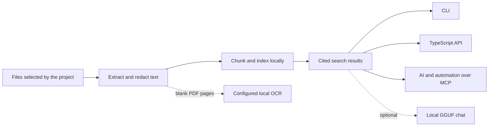

# Ragmir

[](https://www.npmjs.com/package/@jcode.labs/ragmir)
[](https://www.npmjs.com/package/@jcode.labs/ragmir)
[](https://github.com/jcode-works/jcode-ragmir/actions/workflows/ci.yml)
[](https://www.npmjs.com/package/@jcode.labs/ragmir)
[](./LICENSE)

**Confidential local RAG for your coding agents.**

*Stop sending confidential documents directly to the cloud.*

Ragmir indexes the project files you choose on your machine and retrieves bounded, cited evidence
offline by default. The corpus and generated index remain local, so confidential source files are
not uploaded to a hosted RAG service. Connect through project-scoped agent skills, a local MCP
server, the CLI, or the TypeScript API. The default `local-hash` path needs no account, API key, or
model download.

Bring the coding agent or automation you already use. Ragmir Core retrieves evidence without
calling a model. If no retrieved passage may leave the machine, use a local consumer or Ragmir Chat
for cited answer generation from a verified local model.

[Website](https://ragmir.com) · [npm](https://www.npmjs.com/package/@jcode.labs/ragmir) ·
[Documentation](https://github.com/jcode-works/jcode-ragmir/wiki) ·
[CLI reference](./docs/cli-reference.md) · [Examples](#runnable-examples)

## Give your coding agent cited project evidence

Ragmir requires Node.js 20 or later. Install it in the repository that owns the files you want to
search:

```bash
pnpm add -D @jcode.labs/ragmir
pnpm exec rgr setup --agents codex,claude,kimi,opencode,cline
pnpm exec rgr sources add "docs/**/*.md"
pnpm exec rgr ingest
pnpm exec rgr doctor
```

Then ask the selected agent:

```text
Use Ragmir to find which decision changed the rollout. Cite every claim and expand the strongest
citation before you propose an edit.
```

`rgr setup` creates ignored local state under `.ragmir/`, installs project-scoped native skills,
and writes local MCP helpers. `rgr ingest` is incremental, uses bounded parse windows, and commits
durable progress per file. Re-run the same command after an interruption to continue after the last
committed file. The agent receives bounded passages with the source path, excerpt, chunk, verified
source lines when available, PDF pages, PPTX slides, XLSX sheets and cells, or EPUB spine positions.

Prefer a direct search? Run:

```bash
pnpm exec rgr search "Which decision changed the rollout?"
```

Using npm instead of pnpm? Replace `pnpm add -D` with `npm install --save-dev` and `pnpm exec` with
`npx`. At a pnpm workspace root, use `pnpm add -Dw`; otherwise install Ragmir in the package that
owns the source files.

## Pick the interface your workflow needs

| Interface | Use it for | Result |
| --- | --- | --- |
| `rgr` CLI | Setup, ingest, search, audit, and maintenance | Human-readable or JSON output |
| TypeScript API | Embed retrieval in a script or stateful Node.js worker | Typed results with citations and explicit lifecycle |
| Local MCP server | Give your preferred agent bounded project context | Read-focused retrieval tools |
| Ragmir Chat | Keep answer generation on the workstation | Cited offline synthesis |
| Ragmir TTS | Turn a text brief into audio | Local WAV or explicit online MP3 |

Use the CLI or MCP for interactive agent work. Use the TypeScript API when a repeatable Node.js
process owns the control flow. Ragmir does not open an HTTP port: applications own their network,
authentication, and authorization boundary.

Ragmir Core stays retrieval-first. `ask()` returns cited context without calling an LLM. Local chat
and audio are separate capabilities, so retrieval remains useful on machines that should not run a
generative model.

## How it works



The generated index, model cache, reports, and access log stay under ignored `.ragmir/` state.
Project paths are resolved from the caller's working directory or explicit configuration, never
from the installed npm package.

## Common workflows

### Connect a coding agent or script

Setup links skills into supported agents' native project folders and writes local MCP helpers backed
by a generated project runner. Any other MCP client can launch `.ragmir/run.cjs`. Hermes, local
scripts, CI, and internal services can use the same JSON CLI or TypeScript API without a dedicated
connector.

The MCP surface is intentionally bounded and read-focused. Agents can request compact evidence
first, then expand one returned citation without opening a second index or reading arbitrary files.
MCP clients can read `ragmir://context` for a compact base, readiness, freshness, and capability
overview before choosing a tool. Every tool advertises non-destructive behavior, and every tool and
resource JSON response is subject to a byte budget. Search, ask, research, and evaluation
conservatively advertise open-world behavior because explicitly enabled semantic models may
download public weights. Budget pressure returns typed summaries with exact scalar values,
omission counters, and the best search citation instead of shortening paths or identifiers. Tools
that may initialize local state or append metadata-only access logs do not claim read-only or
idempotent behavior.

Core is model-agnostic: any compatible CLI, TypeScript, or MCP consumer can use the returned
citations. A hosted AI receives the passages you return to it under that provider's data policy. A
local consumer keeps the handoff on the workstation, and the optional Chat package adds local
answer generation when the whole workflow must remain offline.

### Route knowledge in a monorepo

```bash
pnpm exec rgr bases
pnpm exec rgr --project-root apps/web search "checkout contract"
```

Ragmir selects the nearest `.ragmir/config.json` from the working directory. A monorepo can keep a
root base for shared knowledge and isolated bases in individual apps. `rgr bases` shows the active
base, generated MCP helpers pin their project root, and nested bases receive distinct server names
so agents do not silently query the wrong index.

### Share one source of truth across a team

Ragmir is local and confidential by design. It has no built-in cloud synchronization. Give every
developer the same source folder through a tool such as the Google Drive desktop app or a team
script, keep the Ragmir version, configuration, embedding provider, and model aligned, then ingest
locally. The result is an equivalent local index on each workstation, not a shared database.

Always sync before `rgr ingest`, then run `rgr audit`. A missing, partially synced, or extra file in
the selected raw or source folder makes that developer's index diverge. Ragmir hashes content on
first discovery and whenever file identity or metadata changes. Set `sourceFingerprintMode` to
`strict` when every inventory must reread every byte, including when a sync tool preserves metadata.
Teams can automate setup with `initProject`, `addSourceEntries`, and `createRagmirClient`; Ragmir
remains the local retrieval layer, not the synchronization layer.

### Audit a knowledge base

```bash
pnpm exec rgr preview --path docs --max-chunks 3
pnpm exec rgr audit --unsupported
pnpm exec rgr security-audit
pnpm exec rgr research "release obligations" --compact --timeout-ms 10000
```

Use this path for policies, runbooks, specifications, contracts, and other corpora where the answer
must remain traceable to evidence. `preview` shows redacted chunks, structural context, citations,
and size distributions without writing an index.
`research` combines language-aware query variants with deterministic cross-query ranking. Its
normal health check reads the active manifest; add `--full-audit` only when the same response must
include a fresh source inventory and duplicate or mirror diagnostics. Code scanning has explicit
file, byte, concurrency, and result limits.

### Explain retrieval decisions

```bash
pnpm exec rgr search "release approval" --explain
pnpm exec rgr search "release approval" --context-path "Operations > Release"
pnpm exec rgr search "release approval" --exact-vector-search
```

Explanations expose reciprocal-rank-fusion contributions, vector and lexical ranks, FTS or fallback
activation and reason, candidate and coverage budgets, queue wait, backend scores, matched terms,
and the active ranking-policy fingerprint without changing default ranking. Independent bounded
queues protect search, embedding, and ingestion. Saturation returns a retryable `OVERLOADED` error
instead of growing memory without limit. Structural context and body text feed
the primary lexical index. Exact file paths use a bounded scalar variant; exact phrases,
identifiers, and fuzzy rare terms expand only an insufficient primary pool. Equal scores
use stable source and chunk tie-breaks, and provider-aware abstention can return no passage instead
of forcing weak evidence. Structural filters apply to both candidate retrieval and hydrated
neighbors. Ragmir keeps exact vector search below 100,000
rows, then maintains a quality-gated IVF-PQ index with complete coverage. The exact-search flag
bypasses that index for diagnostics and result comparison.

### Enable semantic retrieval

```bash
pnpm exec rgr setup --semantic
pnpm exec rgr ingest --rebuild
```

The default `local-hash` provider is offline lexical/hash retrieval. Semantic mode uses
Transformers.js and requires an explicit model download or a preloaded local model. Bundled model
profiles use pinned commits, and setup records a canonical artifact digest so index and quality
fingerprints identify the exact weights. The `local-hash` path never resolves Transformers.js,
ONNX Runtime, or Sharp.

### Resume a long ingestion

```bash
pnpm exec rgr ingest --batch-size 25
pnpm exec rgr status --json
```

Ragmir records per-file progress atomically under ignored `.ragmir/storage/` state. Files from a
committed batch are not parsed or embedded again after a restart. A full `--rebuild` writes to an
isolated generation and activates it only after row and manifest validation, so an interrupted
rebuild leaves the previous searchable index active. Sidecar replacements flush the temporary file
and synchronize the storage directory where the platform supports it. A validated previous
activation manifest remains available for recovery; recovered state is reported as stale until a
rebuild repairs the canonical sidecar. After activation, older generated tables stay available so
searches that already opened them can finish safely. `rgr destroy-index` removes all generated index
storage. At the end of ingestion, Ragmir refreshes incomplete full-text coverage and compacts
LanceDB after 20 mutation batches or when fragment health crosses its threshold. Run
`rgr storage optimize --dry-run --json` to inspect the active table, then omit `--dry-run` for an
explicit maintenance pass. The same maintenance pass creates or refreshes adaptive vector and
`relativePath` scalar indices, and reports their indexed and unindexed rows. Completed rebuilds
retain active, resumable, rollback, and leased generations, then bound ordinary generations to
three after a five-minute reader grace period.
Inspect roles and reclaimable bytes with `rgr storage generations --json`; use
`rgr storage gc --dry-run --json` before explicit cleanup. During incremental ingestion, a changed file that fails keeps its last
known good rows searchable and explicitly stale by default. Repair replaces them without duplicate
IDs, while actual source deletion removes them. Use `--incremental-failure-policy remove-stale` only
when an operator prefers missing evidence to stale evidence.

`rgr status` and the MCP context resource read only the compact activation manifest and durable
progress state. They do not open LanceDB or read chunk text. `rgr doctor` uses the same constant-cost
snapshot by default; use `rgr doctor --deep` for a live O(corpus) source inventory and executable
security probes. `rgr audit` remains the explicit deep O(corpus) source-to-index comparison. A
missing, malformed, or legacy manifest is never reported ready even if a LanceDB table exists.

### Search scanned PDFs

```bash
pnpm exec rgr ocr setup --engine auto
pnpm exec rgr ingest --rebuild
```

Embedded PDF text is always preferred. OCR runs only for blank pages, through a configured local
executable. The generated configuration batches up to 16 pages, stores private content-addressed
page results under `.ragmir/ocr-cache/`, and resumes only missing pages after interruption. Ingest
and preview diagnostics report cache hits, batches, subprocesses, and OCR time without document
content. Ragmir does not use a cloud OCR service.

## Supported content

Ragmir handles common project and knowledge-base material, including:

- Markdown, plain text, source code, configuration, logs, CSV, JSON, JSONL, and YAML;
- PDF with page-aware citations, plus optional local OCR for blank pages;
- PPTX slide, XLSX sheet and cell, and EPUB spine-aware citations;
- DOCX, PPTX, XLSX, OpenDocument files, EPUB, HTML, RTF, email, and notebooks;
- additional text extensions configured by the project.

Run `rgr audit --unsupported` to see what was skipped and why. Ragmir does not claim universal
binary support.

## TypeScript API

```ts
import { createRagmirClient, isRagmirError } from "@jcode.labs/ragmir"

const ragmir = await createRagmirClient({ cwd: process.cwd() })
try {
  await ragmir.ingest({ timeoutMs: 120_000 })

  const results = await ragmir.search("Which decision changed the rollout?", {
    topK: 5,
    explain: true,
    timeoutMs: 10_000,
  })

  for (const result of results) {
    console.log(result.citation, result.text)
  }
} catch (error) {
  if (isRagmirError(error)) console.error(error.code, error.retryable)
  else throw error
} finally {
  await ragmir.close()
}
```

Reuse one client per project root in a long-running process. It keeps one local LanceDB connection
and one immutable read snapshot until atomic generation replacement, accepts `AbortSignal` and
`timeoutMs`, closes retired table snapshots after their last active reader, and flushes access logs
after active operations during `close()`. Closing the final client owner safely disposes its
Transformers pipeline after active inference completes. A private heartbeat lock serializes index
writers across local OS processes while readers remain available.
One-shot `ingest`, `search`, `ask`, and `research` functions remain available for short scripts.

Core also exports `previewChunks`, `audit`, `doctor`, `securityAudit`, bounded context helpers,
closeable MCP construction helpers, and setup helpers. See the [API reference](./docs/api-reference.md)
for the complete public surface.

Ingestion applies backpressure with independent source-byte, chunk, vector, concurrency and batch
ceilings. It commits one file at a time, so cancellation or restart repeats at most one bounded
unit. Run `rgr limits` to inspect the effective limits.

## Privacy boundaries

| Capability | Default behavior | Network boundary |
| --- | --- | --- |
| Core retrieval | Local files, local index, `local-hash` retrieval | No network service required |
| Preferred AI or automation | Receives only the passages the integration requests | The consumer's data policy applies; use a local consumer when passages must not leave |
| Semantic embeddings | Disabled until explicitly enabled | Model download is explicit; inference can then stay local |
| PDF and image OCR | Disabled until a local command is configured | No cloud OCR integration |
| Ragmir Chat | Local inference from a verified GGUF profile | Setup may download the selected profile; answer generation then stays local |
| Ragmir TTS | Local Transformers.js WAV rendering | Edge MP3 mode sends narration text when explicitly selected |

Redaction reduces accidental exposure but is not a compliance certification. Review the
[security hardening guide](./SECURITY-HARDENING.md) before using sensitive corpora.
Custom redaction expressions are rejected when they are invalid or susceptible to catastrophic
backtracking. `rgr security-audit` checks every configured private path for permissions, Git ignore
coverage and tracked files, and reports the operator authority granted to local extractors.

## Packages

| Package | Use it when you need |
| --- | --- |
| [`@jcode.labs/ragmir`](./packages/ragmir-core/README.md) | CLI, retrieval API, MCP server, OCR configuration, and agent helpers |
| [`@jcode.labs/ragmir-chat`](./packages/ragmir-chat/README.md) | Optional cited generation with a local GGUF model |
| [`@jcode.labs/ragmir-tts`](./packages/ragmir-tts/README.md) | Optional local audio or explicit online voice rendering |

Installing Core does not install Chat or TTS. Add only the optional package needed by the workflow.
Choose Chat with `--profile lite`, `fast`, or `quality`; choose offline TTS with `--lang en`, `fr`,
or `es`. The package guides explain the model sizes, preload step, and online boundaries.

## Runnable examples

| Example | What it proves |
| --- | --- |
| [Confidential local RAG demo](./packages/ragmir-core/examples/sovereign-rag-demo/README.md) | End-to-end CLI ingestion, retrieval, redaction, audit, and evaluation |
| [Library API demo](./packages/ragmir-core/examples/library-api-demo/README.md) | The public TypeScript API against a synthetic local corpus |
| [Document evidence benchmark](./packages/ragmir-core/examples/document-evidence-benchmark/README.md) | Deterministic recall and exact verifiable file, line, chunk, and PDF-page citations |

Every committed example uses fictional data. Keep private evaluation corpora and generated reports
outside Git or under ignored local state.

## Technology

- **TypeScript and Node.js** for the portable CLI, library, MCP server, and add-ons.
- **LanceDB** for embedded local storage.
- **Transformers.js** for optional semantic embeddings and offline audio models.
- **Model Context Protocol TypeScript SDK** for agent integrations.
- **node-llama-cpp** for optional local GGUF generation.
- **Astro, React, and Tailwind CSS** for the static, telemetry-free project site.

## Documentation

Browse the [project wiki](https://github.com/jcode-works/jcode-ragmir/wiki) to navigate the complete
documentation. The versioned files below remain canonical for releases, npm packages, Context7,
and pull-request review.

| Guide | Read it when you need |
| --- | --- |
| [Project wiki](https://github.com/jcode-works/jcode-ragmir/wiki) | Browse every guide from one documentation index |
| [CLI reference](./docs/cli-reference.md) | Commands, options, and JSON output |
| [API reference](./docs/api-reference.md) | TypeScript exports and result shapes |
| [Release history](https://github.com/jcode-works/jcode-ragmir/releases) | Generated notes, compatibility changes, and verification artifacts |
| [Changelog](./CHANGELOG.md) | Semantic Versioning and API compatibility policy |
| [Configuration](./docs/configuration.md) | Sources, privacy profiles, models, limits, and extractors |
| [Agent integration](./docs/agent-integration.md) | Native helpers and MCP clients |
| [Troubleshooting](./docs/troubleshooting.md) | Empty indexes, OCR, retrieval, or local-model problems |
| [Offline chat](./docs/offline-chat-preload.md) | Prepare and verify a GGUF model |
| [Offline TTS](./docs/offline-tts-preload.md) | Prepare and render confidential narration |

## Contributing

The repository is a pnpm workspace and uses the Node.js version pinned in `mise.toml`:

```bash
pnpm bootstrap
pnpm validate
pnpm example
```

Read [CONTRIBUTING.md](./CONTRIBUTING.md) before opening a pull request. Report vulnerabilities
through [SECURITY.md](./SECURITY.md), not a public issue. Release history is available in
[GitHub Releases](https://github.com/jcode-works/jcode-ragmir/releases), with compatibility policy
in [CHANGELOG.md](./CHANGELOG.md).

## License

Ragmir is open source under the [MIT License](./LICENSE).

Created and maintained by [Jean-Baptiste Théry](https://github.com/jb-thery) through
[jCode Works](https://github.com/jcode-works).
