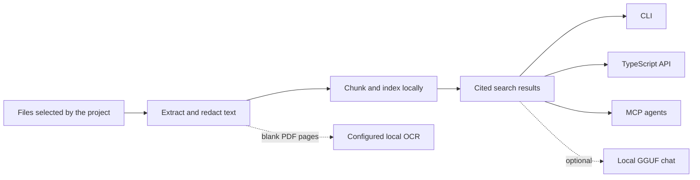

# Ragmir

[](https://www.npmjs.com/package/@jcode.labs/ragmir)
[](https://www.npmjs.com/package/@jcode.labs/ragmir)
[](https://github.com/jcode-works/jcode-ragmir/actions/workflows/ci.yml)
[](https://www.npmjs.com/package/@jcode.labs/ragmir)
[](./LICENSE)

**Local, cited retrieval for the documents and code your AI agents need.**

Ragmir is an open-source retrieval-augmented generation (RAG) toolkit for Node.js. It indexes the
files you choose, stores the index inside the project, and returns source-backed passages through a
CLI, TypeScript API, or local MCP server. The default path needs no account, hosted document store,
or model download.

[Website](https://ragmir.com) · [npm](https://www.npmjs.com/package/@jcode.labs/ragmir) ·
[CLI reference](./docs/cli-reference.md) · [Examples](#runnable-examples)

## Your first cited search

Ragmir requires Node.js 20 or later. Install it in the repository that owns the files you want to
search:

```bash
pnpm add -D @jcode.labs/ragmir
pnpm exec rgr setup
pnpm exec rgr sources add "docs/**/*.md"
pnpm exec rgr ingest
pnpm exec rgr search "Which decision changed the rollout?"
```

`rgr setup` creates ignored local state under `.ragmir/`. `rgr ingest` is incremental. Search
results include the source path, excerpt, chunk number, and PDF page when one is available.

Using npm instead of pnpm? Replace `pnpm add -D` with `npm install --save-dev` and `pnpm exec` with
`npx`.

## What Ragmir gives you

| Interface | Use it for | Result |
| --- | --- | --- |
| `rgr` CLI | Setup, ingest, search, audit, and maintenance | Human-readable or JSON output |
| TypeScript API | Embed retrieval in a Node.js application | Typed results with citations |
| Local MCP server | Give coding agents bounded project context | Read-focused retrieval tools |
| Ragmir Chat | Generate an answer with a local GGUF model | Cited local synthesis |
| Ragmir TTS | Turn a text brief into audio | Local WAV or explicit online MP3 |

Ragmir Core stays retrieval-first. `ask()` returns cited context without calling an LLM. Local chat
and audio are separate capabilities, so retrieval remains useful on machines that should not run a
generative model.

## How it works



The generated index, model cache, reports, and access log stay under ignored `.ragmir/` state.
Project paths are resolved from the caller's working directory or explicit configuration, never
from the installed npm package.

## Common workflows

### Give an agent cited project context

```bash
pnpm exec rgr setup --agents claude,codex,kimi,opencode,cline
pnpm exec rgr doctor
```

Setup writes local helper files for the selected agents. The MCP surface is intentionally bounded
and read-focused. Agents can request compact evidence first, then expand one returned citation
without opening a second index or reading arbitrary files. MCP clients can read `ragmir://context`
for a compact base, readiness, freshness, and capability overview before choosing a tool.

### Route knowledge in a monorepo

```bash
pnpm exec rgr bases
pnpm exec rgr --project-root apps/web search "checkout contract"
```

Ragmir selects the nearest `.ragmir/config.json` from the working directory. A monorepo can keep a
root base for shared knowledge and isolated bases in individual apps. `rgr bases` shows the active
base, generated MCP helpers pin their project root, and nested bases receive distinct server names
so agents do not silently query the wrong index.

### Audit a knowledge base

```bash
pnpm exec rgr audit --unsupported
pnpm exec rgr security-audit
pnpm exec rgr research "release obligations" --compact
```

Use this path for policies, runbooks, specifications, contracts, and other corpora where the answer
must remain traceable to evidence.

### Enable semantic retrieval

```bash
pnpm exec rgr setup --semantic
pnpm exec rgr ingest --rebuild
```

The default `local-hash` provider is offline lexical/hash retrieval. Semantic mode uses
Transformers.js and requires an explicit model download or a preloaded local model.

### Search scanned PDFs

```bash
pnpm exec rgr ocr setup --engine auto
pnpm exec rgr ingest --rebuild
```

Embedded PDF text is always preferred. OCR runs only for blank pages, through a configured local
executable. Ragmir does not use a cloud OCR service.

## Supported content

Ragmir handles common project and knowledge-base material, including:

- Markdown, plain text, source code, configuration, logs, CSV, JSON, JSONL, and YAML;
- PDF with page-aware citations, plus optional local OCR for blank pages;
- DOCX, PPTX, XLSX, OpenDocument files, EPUB, HTML, RTF, email, and notebooks;
- additional text extensions configured by the project.

Run `rgr audit --unsupported` to see what was skipped and why. Ragmir does not claim universal
binary support.

## TypeScript API

```ts
import { ingest, search } from "@jcode.labs/ragmir"

await ingest({ cwd: process.cwd() })

const results = await search("Which decision changed the rollout?", { topK: 5 })

for (const result of results) {
  console.log(result.citation, result.text)
}
```

Core also exports `ask`, `research`, `audit`, `doctor`, `securityAudit`, `serveMcp`, and setup
helpers. See the [API reference](./docs/api-reference.md) for the public surface.

## Privacy boundaries

| Capability | Default behavior | Network boundary |
| --- | --- | --- |
| Core retrieval | Local files, local index, `local-hash` retrieval | No network service required |
| Semantic embeddings | Disabled until explicitly enabled | Model download is explicit; inference can then stay local |
| PDF and image OCR | Disabled until a local command is configured | No cloud OCR integration |
| Ragmir Chat | Local inference from a verified GGUF file | Setup may download the selected model |
| Ragmir TTS | Local Transformers.js WAV rendering | Edge MP3 mode sends narration text when explicitly selected |

Redaction reduces accidental exposure but is not a compliance certification. Review the
[security hardening guide](./SECURITY-HARDENING.md) before using sensitive corpora.

## Packages

| Package | Install when you need |
| --- | --- |
| [`@jcode.labs/ragmir`](./packages/ragmir-core/README.md) | CLI, retrieval API, MCP server, OCR configuration, and agent helpers |
| [`@jcode.labs/ragmir-chat`](./packages/ragmir-chat/README.md) | Optional cited generation with a local GGUF model |
| [`@jcode.labs/ragmir-tts`](./packages/ragmir-tts/README.md) | Optional local audio or explicit online voice rendering |

## Runnable examples

| Example | What it proves |
| --- | --- |
| [Sovereign RAG demo](./packages/ragmir-core/examples/sovereign-rag-demo/README.md) | End-to-end CLI ingestion, retrieval, redaction, audit, and evaluation |
| [Library API demo](./packages/ragmir-core/examples/library-api-demo/README.md) | The public TypeScript API against a synthetic local corpus |
| [Document evidence benchmark](./packages/ragmir-core/examples/document-evidence-benchmark/README.md) | Deterministic recall and exact file, line, chunk, and PDF-page citations |

Every committed example uses fictional data. Keep private evaluation corpora and generated reports
outside Git or under ignored local state.

## Technology

- **TypeScript and Node.js** for the portable CLI, library, MCP server, and add-ons.
- **LanceDB** for embedded local storage.
- **Transformers.js** for optional semantic embeddings and offline audio models.
- **Model Context Protocol TypeScript SDK** for agent integrations.
- **node-llama-cpp** for optional local GGUF generation.
- **Astro, React, and Tailwind CSS** for the static, telemetry-free project site.

## Documentation

| Guide | Read it when you need |
| --- | --- |
| [CLI reference](./docs/cli-reference.md) | Commands, options, and JSON output |
| [API reference](./docs/api-reference.md) | TypeScript exports and result shapes |
| [Configuration](./docs/configuration.md) | Sources, privacy profiles, models, limits, and extractors |
| [Agent integration](./docs/agent-integration.md) | Native helpers and MCP clients |
| [Troubleshooting](./docs/troubleshooting.md) | Empty indexes, OCR, retrieval, or local-model problems |
| [Offline chat](./docs/offline-chat-preload.md) | Prepare and verify a GGUF model |
| [Offline TTS](./docs/offline-tts-preload.md) | Prepare and render confidential narration |

## Contributing

The repository is a pnpm workspace and uses the Node.js version pinned in `mise.toml`:

```bash
pnpm bootstrap
pnpm validate
pnpm example
```

Read [CONTRIBUTING.md](./CONTRIBUTING.md) before opening a pull request. Report vulnerabilities
through [SECURITY.md](./SECURITY.md), not a public issue. Release history is available in
[CHANGELOG.md](./CHANGELOG.md).

## License

Ragmir is open source under the [MIT License](./LICENSE).
