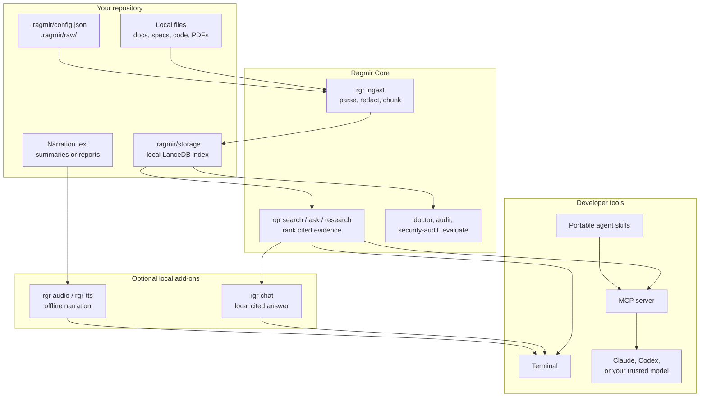

# Ragmir

[](https://github.com/jcode-works/jcode-ragmir/actions/workflows/ci.yml)
[](https://github.com/jcode-works/jcode-ragmir/actions/workflows/codeql.yml)
[](https://www.npmjs.com/package/@jcode.labs/ragmir)
[](https://www.npmjs.com/package/@jcode.labs/ragmir)
[](https://github.com/jcode-works/jcode-ragmir/blob/main/LICENSE)
[](https://github.com/sponsors/jb-thery)

Open-source local RAG library, CLI, and MCP server. Ragmir indexes your specs, docs, and code
locally and gives your AI agents only the useful cited passages, over MCP, without burning tokens on
your whole repo.

Build from your requirements, keep everything on your machine, and let Claude, Codex, Kimi,
OpenCode, Cline, or any MCP client answer from your real sources. Ragmir installs into any Node.js
repository, stores vectors locally with LanceDB, and runs fully offline by default, with built-in
local-hash retrieval or optional Transformers.js semantic embeddings.

Ragmir Core returns cited retrieval context with line-aware citations after indexing. Answer
synthesis belongs to the AI agent, LLM, or local model runtime you choose around it, so every answer
stays grounded in your real evidence.

Ragmir complements agent memory. It does not replace the conversation state, task plan, or native
code index of Claude, Codex, Kimi, OpenCode, Cline, or another agent. It gives those agents a local,
read-focused evidence layer for documents they should cite instead of guess from.

Created by Jean-Baptiste Thery and published under the JCode Labs npm scope.

## Developer Use Cases

Ragmir is designed for agent-assisted development when the useful context is local, private, and
spread across repositories, specifications, exports, and synced folders.

| Use case | What it enables |
| --- | --- |
| Index a repository's documentation | Ask Claude Code, Codex, Kimi Code CLI, OpenCode, Cline, or another agent to implement features from local README files, architecture notes, API contracts, ADRs, and runbooks. |
| Code from a specification or `cahier des charges` | Turn a local PRD, tender response, client brief, or engineering spec into an implementation plan, acceptance checklist, and cited change guidance. |
| Work from a downloaded Google Drive folder | Point Ragmir at files synced locally through Google Drive for desktop, then let the agent retrieve context without uploading the corpus to a hosted RAG service. |
| Onboard to a legacy codebase | Ask where a flow is implemented, which modules own a responsibility, which docs explain a behavior, and what to read before changing risky code. |
| Turn a dense document into a listenable mini-learning | Generate a short spoken summary (MP3/WAV) from cited passages with `rgr audio`, to review a spec, architecture doc, or research pass hands-free instead of only reading dense text. |
| Keep multiple agents on the same evidence | Install the same project skills and MCP server for Claude Code, Codex, Kimi Code CLI, OpenCode, and Cline so each tool retrieves from the same local index. |
| Let agents decide when local context is needed | Use `rgr route-prompt` or MCP `ragmir_route_prompt` from agent hooks and skills to classify a prompt before spending retrieval tokens. |
| Research before implementation | Run an audit-backed multi-query pass over specs, docs, and code references before asking an agent to plan a feature, migration, or review. |
| Prepare implementation and review work | Generate cited task breakdowns, migration notes, release checklists, QA plans, and code-review context from the same local sources the team uses. |
| Audit local knowledge coverage | Check which supported files were indexed, which formats were skipped, whether secrets are likely present, and whether golden queries still retrieve expected evidence. |

The workflow stays simple: keep files on disk, run `rgr ingest`, connect your coding agent through
MCP or portable skills, then ask it to work from cited local passages.

## At A Glance

Ragmir is the local evidence layer for AI agents: put documents in a repository, index them locally,
then let your CLI, MCP-compatible agent, or bundled skills retrieve cited passages without uploading
the corpus to a hosted RAG service.



The fastest useful path is to install Ragmir in the repository, wire it into the coding agent you
already use, then ask that agent questions grounded in local files:

```bash
npm install --save-dev @jcode.labs/ragmir
npx rgr setup
# Optional: download a Transformers.js embedding model once and enable higher-quality semantic retrieval.
npx rgr setup --semantic
npx rgr install-agent --agents claude,codex,kimi,opencode,cline
npx rgr doctor --fix
npx rgr research "release readiness and risks" --compact

# Claude Code
claude mcp add-json --scope local ragmir "$(cat .ragmir/claude-mcp-server.json)"

# Codex
cat .ragmir/codex-mcp.toml

# Kimi Code CLI
kimi --mcp-config-file .ragmir/kimi-mcp.json

# OpenCode
cat .ragmir/opencode.jsonc

# Cline
cat .ragmir/cline-mcp.json
```

`rgr` is the public CLI command. The older `ragmir` command and legacy `kb` alias remain available as
deprecated compatibility bins for existing scripts and print migration warnings; update automation to
use `rgr`.

Use it when an agent needs grounded context over private specs, codebases, legal dossiers, tenders,
course material, project archives, or meeting notes, but the files should remain on your machine.

## Packages

This root README is the canonical product documentation for the public npm packages.

| Package | Role |
| --- | --- |
| `@jcode.labs/ragmir` | Ragmir Core: CLI, library, MCP server, bundled agent skills, and synthetic examples. |
| `@jcode.labs/ragmir-tts` | Ragmir add-on for Edge-quality MP3 and offline Transformers.js WAV rendering through `rgr audio`. |
| `@jcode.labs/ragmir-chat` | Optional local cited chat add-on for `rgr chat`, backed by verified Qwen2.5 or Gemma 4 GGUF models and llama.cpp. |
| `@jcode.labs/ragmir-ui` | Unpublished workspace UI package adapted from the WorkoutGen design foundation for Ragmir surfaces. |
| `@jcode.labs/ragmir-landing` | Unpublished Astro static landing package. Product-facing titles stay `Ragmir`. |
| `@jcode.labs/ragmir-app` | Unpublished Tauri desktop/mobile shell package. Native builds are explicit app commands. Core integration uses a bounded native command around the `rgr` CLI, with packaged sidecar distribution still planned. |
| `@jcode.labs/ragmir-license-webhook` | Unpublished, undeployed MIT-licensed Cloudflare Worker handler for future Lemon Squeezy webhooks and local `RAGMIR1` license issuance. |

The package README files are intentionally short because npm displays each package README
separately. They point npm readers back to this GitHub documentation.

The product name visible to users is **Ragmir**. The technical core package is **Ragmir Core** and now
lives under `packages/ragmir-core`; the public npm package name remains `@jcode.labs/ragmir`.

The public source and commercial distribution boundary is tracked in
[`docs/source-boundary.md`](./docs/source-boundary.md) and
[`docs/commercial-distribution.md`](./docs/commercial-distribution.md). No checkout URL, production
download URL, customer data, or license secret is committed to this repository.

## Documentation

Use this README as the entrypoint, then jump into the focused docs when you need command tables,
agent wiring, API shapes, security details, or app packaging rules:

| Document | Use it for |
| --- | --- |
| [`docs/cli-reference.md`](./docs/cli-reference.md) | Complete `rgr`, `rgr-chat`, and `rgr-tts` command reference. |
| [`docs/api-reference.md`](./docs/api-reference.md) | Public TypeScript API, setup options, semantic model preload, and MCP tool inputs. |
| [`docs/agent-integration.md`](./docs/agent-integration.md) | Claude Code, Codex, Kimi Code CLI, OpenCode, and Cline setup. |
| [`docs/troubleshooting.md`](./docs/troubleshooting.md) | Empty indexes, weak search, strict security audit warnings, and audio preload fixes. |
| [`SECURITY-HARDENING.md`](./SECURITY-HARDENING.md) | Threat model, offline operation, release verification, and higher-assurance deployment notes. |
| [`docs/offline-chat-preload.md`](./docs/offline-chat-preload.md) | Preload, verify, and run the optional local chat models offline. |
| [`docs/offline-tts-preload.md`](./docs/offline-tts-preload.md) | Preload and verify the offline Transformers.js TTS cache. |
| [`docs/fr-eu-sovereign-positioning.md`](./docs/fr-eu-sovereign-positioning.md) | Bounded FR/EU sovereignty, GDPR, AI Act, and legal-vertical positioning. |
| [`docs/source-boundary.md`](./docs/source-boundary.md) | What the public MIT repository contains and what must stay outside Git. |
| [`docs/commercial-distribution.md`](./docs/commercial-distribution.md) | Public-safe commercial distribution rules for signed builds, licenses, and support. |
| [`docs/app-sidecar-architecture.md`](./docs/app-sidecar-architecture.md) | Desktop app sidecar and native bridge constraints. |
| [`docs/app-distribution.md`](./docs/app-distribution.md) | Direct-download native app packaging and release preflight. |
| [`docs/payment-webhook-architecture.md`](./docs/payment-webhook-architecture.md) | Future checkout, webhook, and local-license architecture. |
| [`llms.txt`](./llms.txt) | LLM-oriented documentation index for tools such as Context7. |

## Open Source

Ragmir is a public open-source project under the MIT License. It is designed to be inspectable,
forkable, and usable without a JCode Labs account.

Every tracked package in this repository is visible source. Commercial Ragmir app distribution can
gate official signed builds, support, updates, and hosted license delivery, but it does not make the
tracked Tauri app or webhook source proprietary.

Contributions are welcome through pull requests. Start with [`CONTRIBUTING.md`](./CONTRIBUTING.md).
Security reports should stay private and follow [`SECURITY.md`](./SECURITY.md).

## Sponsors

Ragmir stays MIT open source. Sponsorship helps fund maintenance, issue triage, documentation, and
practical agent-workflow improvements.

Sponsor the project through [GitHub Sponsors](https://github.com/sponsors/jb-thery).

Suggested GitHub Sponsors tiers:

- EUR 5/month: support the project.
- EUR 15/month: active sponsor.
- EUR 49/month: priority on issues and questions.
- EUR 199/month: company sponsor and light advisory support.

## Status

Early public package. APIs may evolve before `1.0.0`.

## Desktop Client Preview

Ragmir Core is the open-source product you can use today through the CLI, library, MCP server, and
portable agent skills.

A cross-platform Ragmir desktop/mobile client is being developed in `packages/ragmir-app`. Its goal is
to make local confidential workspaces easier for non-CLI workflows: register a local dossier, run
setup and ingest, ask questions with cited local passages, inspect privacy posture, and preload
embedding models explicitly. Google Drive support is implemented as an opt-in local-sync folder flow
over files already present on disk, not as a default cloud API integration.

The native client is not released, signed, or commercially distributed yet. There is no checkout,
waitlist, or hosted account flow in this repository. When released, it is planned for direct
downloads and sideloadable installers, not App Store or Play Store distribution.

The canonical landing and future direct-download release URL is
[`ragmir.com`](https://ragmir.com). It is prepared as a Cloudflare Workers Static Assets
site, but public deployment remains a separate release action.

## What Ragmir Is For

- Build a local RAG knowledge base inside any repository.
- Analyze confidential datasets while keeping raw files and generated indexes local.
- Give Claude, Codex, Kimi, OpenCode, Cline, internal assistants, or other MCP-compatible tools the
  same private retrieval layer.
- Retrieve grounded local evidence through CLI, library calls, MCP tools, or bundled agent skills.
- Optionally create listenable MP3/WAV summaries or cited Markdown reports with bundled skills.
- Prepare legal-dossier summaries, chronologies, clause reviews, and professional-review handoffs
  with the optional bundled legal skill.

Ragmir is not a hosted SaaS, not a remote vector database, and not a certified high-assurance system.
For regulated or state-grade environments, pair it with encrypted disks, controlled machines,
release verification, and an external security review.

## Requirements

- Node.js 20 or newer.
- pnpm, npm, yarn, or bun.
- A repository where generated local folders can be ignored by Git.
- No model runtime is required for the default `embeddingProvider: "local-hash"` mode.
- Optional semantic embeddings use Transformers.js with local model files under `.ragmir/models` by
  default. Use `rgr models pull` when remote model download is acceptable, then keep
  `transformersAllowRemoteModels` false for confidential indexing.
- Generated answers are intentionally outside Ragmir core. Use Claude, Codex, OpenAI, a local model
  MCP server, the optional `@jcode.labs/ragmir-chat` add-on, or another trusted model runtime to
  synthesize from Ragmir's cited context.
- Optional audio summaries use `@jcode.labs/ragmir-tts`. For highest-quality MP3, install the
  external `edge-tts` CLI and render with `--engine edge`. For confidential or air-gapped content,
  use the Transformers.js WAV path with `--engine transformers --offline`; it does not require
  Python, ffmpeg, Piper, XTTS, or a local server.
- Optional local chat uses `@jcode.labs/ragmir-chat` through `rgr chat`. Run `rgr chat setup` once to
  download and verify the default Gemma 4 E2B QAT model under `.ragmir/models/chat/fast`, then answer
  locally with `rgr chat "question"`. Use `--profile lite` for the 491 MB Qwen2.5 option on older
  computers, or `--profile quality` to opt into the larger E4B model.
- Optional Markdown reports use the bundled `ragmir-markdown-report` skill and should stay under
  ignored `.ragmir/reports/` unless explicitly sanitized for sharing.

## Install

The package is public. Users do not need a JCode Labs account or npm token to install it.

With npm:

```bash
npm install --save-dev @jcode.labs/ragmir
```

With pnpm:

```bash
pnpm add -D @jcode.labs/ragmir
```

Install the standalone TTS package only when you want to use it directly:

```bash
npm install --save-dev @jcode.labs/ragmir-tts
```

Install the standalone chat package only when you want to use it directly:

```bash
npm install --save-dev @jcode.labs/ragmir-chat
```

Maintainer tokens are only needed to publish new versions.

## Quick Start

Initialize a repository, install the portable agent kit, run readiness checks, and ingest documents
when supported files are already present:

```bash
# Fast start: no model download, fully local lexical/hash retrieval.
npx rgr setup

# Higher-quality natural-language retrieval: one-time Transformers.js model download,
# then remote model loading stays disabled for normal confidential indexing.
npx rgr setup --semantic
```

Fresh setup keeps local state under one ignored `.ragmir/` folder:

```plain text
.ragmir/config.json               # local config
.ragmir/raw/                      # raw documents to ingest
.ragmir/storage/                  # generated LanceDB index after ingest
.ragmir/access.log                # metadata-only access log after use
.ragmir/skills/ragmir/SKILL.md     # portable agent skill
.ragmir/skills/ragmir-audio-summary/SKILL.md
.ragmir/skills/ragmir-markdown-report/SKILL.md
.ragmir/skills/ragmir-legal-dossier/SKILL.md
.ragmir/mcp.json                  # generic MCP server config snippet
.ragmir/claude-mcp-server.json    # Claude Code add-json payload
.ragmir/codex-mcp.toml            # Codex config.toml snippet with MCP and skills.config
.ragmir/kimi-mcp.json             # Kimi Code CLI MCP config
.ragmir/opencode.jsonc            # OpenCode config snippet
.ragmir/cline-mcp.json            # Cline MCP config
.ragmir/agent-setup.md            # agent-specific setup guide
.gitignore                       # ignores .ragmir/
```

It detects the repository package manager and writes the MCP helper files with the right command:
`npx rgr serve-mcp`, `pnpm exec rgr serve-mcp`, `yarn exec rgr serve-mcp`, or `bunx rgr serve-mcp`.
When a repository needs a wrapper script or only a subset of agent helpers, make that explicit during
setup:

```bash
npx rgr setup --agents claude,codex --mcp-name project-docs --mcp-command ./scripts/serve-mcp.sh
```

For the usual agent-first workflow, expose Ragmir to the coding assistants used in the repository:

```bash
npx rgr install-agent --agents claude,codex,kimi,opencode,cline
```

Then wire the agent you use. Claude Code, Codex, and Cline follow the standard MCP shapes from their
public docs; Kimi and OpenCode use the generated helper files that Ragmir writes under `.ragmir/`.

```bash
# Claude Code: registers the local MCP server for this repository.
claude mcp add-json --scope local ragmir "$(cat .ragmir/claude-mcp-server.json)"

# Codex: review and merge the generated MCP and skills config.
cat .ragmir/codex-mcp.toml

# Kimi Code CLI: launch Kimi with the generated Ragmir MCP config.
kimi --mcp-config-file .ragmir/kimi-mcp.json

# OpenCode: review and merge the generated OpenCode JSONC snippet.
cat .ragmir/opencode.jsonc

# Cline: add the generated JSON under Cline's mcpServers configuration.
cat .ragmir/cline-mcp.json
```

From the agent, ask naturally, for example: "Use Ragmir to find what this repository says about
deployment." The agent calls the MCP tools and uses the bundled skills to work with cited local
context.

Check readiness at any time:

```bash
npx rgr doctor
```

If files are missing from the index, stale, or the setup is incomplete, run:

```bash
npx rgr doctor --fix
```

`doctor --fix` performs safe repairs: missing scaffolding, Git ignore entries, agent kit install, and
index rebuild when supported files are present and the privacy posture has no warnings.

Manual initialization is still available:

```plain text
.ragmir/config.json   # local config (add extra paths to the "sources" array)
.ragmir/raw/          # raw documents to ingest
.gitignore           # ignores .ragmir/
```

Put supported files under `.ragmir/raw/`:

```plain text
.ragmir/raw/
  policy.md
  meeting-notes.pdf
  requirements.docx
```

For monorepos or downloaded local folders, add extra paths or glob patterns to the `sources` array in
`.ragmir/config.json`. Relative entries resolve from the Ragmir project root, and `!` excludes matched files:

```json
{
  "sources": [
    "../apps/*/README.md",
    "../apps/*/docs/**/*.{md,mdx}",
    "../packages/*/architecture/**/*.md",
    "!../apps/**/node_modules/**"
  ]
}
```

Manage extra source paths through the CLI:

```bash
npx rgr sources add "../apps/*/README.md" "../apps/*/docs/**/*.{md,mdx}"
npx rgr sources list
```

### Team Workflow With A Shared Private Corpus

For a team of 10 developers, keep Git as the reproducible setup layer and keep the corpus in an
approved private source. Each developer materializes the same corpus locally, then builds their own
local Ragmir index.

```plain text
Git repository
  README.md
  ragmir.config.example.json
  ragmir-sources.example.txt
  scripts/sync-corpus.sh

Ignored local state on each developer machine
  .ragmir/config.json
  .ragmir/raw/ or data/private-corpus/
  .ragmir/storage/
  .ragmir/access.log
  .ragmir/models/
```

If your team uses Google Drive, Dropbox, SharePoint, S3, rsync, an encrypted ZIP, or another private
source, write a small project script that syncs into an ignored local folder and then ingests:

```bash
#!/usr/bin/env bash
set -euo pipefail

mkdir -p .ragmir/raw
# Example only: replace this with your approved private sync command.
# rclone copy "team-drive:Project Knowledge" .ragmir/raw --drive-export-formats docx,xlsx,pptx,pdf

npx rgr ingest
npx rgr doctor
```

Commit the script and instructions, not the synced files. The same pattern works without Google
Drive: every developer downloads the same approved archive or mirror into the same ignored path, then
runs `npx rgr ingest`. Ragmir compares checksums and reuses unchanged rows, so refreshes stay
incremental.

Build the local index:

```bash
npx rgr ingest
npx rgr doctor
```

When the index is ready, `rgr doctor` prints `ready=true`. `rgr ingest` and `rgr audit` also report
files that were discovered but not indexed because the type is unsupported, the file is too large,
or the file name looks like a secret/private key.

List skipped paths explicitly:

```bash
npx rgr audit --unsupported
```

Summarize recent metadata-only usage without exposing raw queries or local paths:

```bash
npx rgr usage-report --days 7
```

Retrieve exact passages:

```bash
npx rgr search "approval for offline operation"
```

Constrain retrieval to a source family, or remove literature and mirror folders from the candidate
set, before ranking:

```bash
npx rgr search "current patient findings" --include-path ".ragmir/raw/primary"
npx rgr research "evidence gaps" --exclude-path ".ragmir/raw/research" --exclude-path ".ragmir/raw/archive"
```

Path filters accept exact project-relative files or directory prefixes and can be repeated. They
also apply to `ask`, MCP search/ask/research, and individual golden evaluation queries.

Return cited retrieval context for an agent or model:

```bash
npx rgr ask "What evidence supports offline operation?"
```

Run an audit-backed multi-query research pass before a broad synthesis or implementation task:

```bash
npx rgr research "release readiness and risks" --compact
```

Measure retrieval quality and latency against a golden query file:

```bash
npx rgr evaluate --golden golden-queries.json
```

Golden queries can require file-level hits with `expectedPaths` and exact citation hits with
`expectedCitations` in `relative/path:Lx-Ly#chunkIndex` format. Use exact citations when the benchmark
needs to prove that Ragmir retrieved the right passage, not only the right file. PDF citations also
include a page, for example `brief.pdf:p2:L4-L8#3`. Older indexes without line or page metadata fall
back to `relative/path#chunkIndex` until they are rebuilt. Evaluation reports hit rate, true
Recall@K, Precision@K, MRR, bounded nDCG, and p50/p95 retrieval latency. Each query may also define
`includePaths` and `excludePaths`, which is useful for separate primary-source and literature gates.

For private dogfooding, keep the real corpus and golden query file outside Git or under an ignored
local path, then use a threshold that matches the evaluation phase:

```bash
npx rgr --project-root /path/to/workspace ingest
npx rgr --project-root /path/to/workspace evaluate --golden .ragmir/evaluations/golden-queries.json --fail-under 0.8 --json
```

The JSON report includes the active `embeddingProvider` and `embeddingModel`, so you can compare
default local-hash recall with a private Transformers semantic run without storing the report in Git.

Ragmir does not synthesize an LLM answer. It returns cited local passages; your chosen agent or model
does the writing around those passages.

With pnpm, use `pnpm exec` after installing the package:

```bash
pnpm exec rgr setup
pnpm exec rgr doctor
pnpm exec rgr search "approval for offline operation"
```

## Choose A Retrieval Mode

Ragmir has two embedding modes.

### Default Local Hash Retrieval

Use this when you want a fully local, no-model smoke test or a dependency-light setup. Retrieval is
lexical/hash-based, not semantic.

`.ragmir/config.json`:

```json
{
  "embeddingProvider": "local-hash"
}
```

Commands:

```bash
npx rgr ingest
npx rgr search "offline retrieval approval"
npx rgr ask "What evidence supports offline operation?"
```

`rgr ask` always returns cited retrieved passages instead of a generated synthesis. You can pass those
passages to any LLM or agent you trust.

### Optional Local Chat

Use this when you want a local model to answer from Ragmir citations without adding Ollama or another
model server. The core stays retrieval-only; `@jcode.labs/ragmir-chat` runs verified Qwen2.5 or Gemma 4 GGUF models through
`node-llama-cpp`, with no Python or hosted inference API.

```bash
npx rgr chat setup
npx rgr chat "Which evidence supports offline operation?" --thinking standard

# Ultra-light profile for older computers.
npx rgr chat setup --profile lite
npx rgr chat "Summarize the cited evidence." --profile lite --thinking off

# Optional quality profile for machines with more memory.
npx rgr chat setup --profile quality
npx rgr chat "Summarize the strongest evidence." --profile quality --thinking deep
```

The `lite` profile downloads Qwen2.5 0.5B Instruct Q4_K_M, about 491 MB, uses a 4,096-token context,
caps generation at 512 tokens, and always disables thinking. The default `fast` profile downloads
Google's Gemma 4 E2B QAT Q4_0 GGUF, about 3.35 GB. The optional `quality` profile uses E4B, about 5.15
GB. Setup verifies the exact file size and SHA256 before
writing a local manifest. Normal answers never download a model. Thinking can be disabled or given
standard/deep budgets, but raw thought text is discarded and never added to the visible chat
history. Citations are validated against the retrieved source list, and important answers still need
review against those passages. See [`docs/offline-chat-preload.md`](./docs/offline-chat-preload.md)
for air-gapped setup, profiles, and model verification.

Each GGUF is portable across desktop systems. Ragmir automatically selects Metal on Apple
Silicon and CUDA or Vulkan on supported Linux/Windows machines, using CPU only when that is the
available packaged backend. Run `npx rgr chat doctor --json` to see the actual platform,
architecture, supported backends, selected backend, and hardware-acceleration status. MLX is not a
second default: MLX-LM requires Python, while MLX Swift would require a separate Mac-only runtime and
model format that still needs an A/B benchmark against the existing Metal path.

The model files come from the official
[Qwen2.5 0.5B Instruct](https://huggingface.co/Qwen/Qwen2.5-0.5B-Instruct-GGUF),
[Gemma 4 E2B](https://huggingface.co/google/gemma-4-E2B-it-qat-q4_0-gguf) and
[Gemma 4 E4B](https://huggingface.co/google/gemma-4-E4B-it-qat-q4_0-gguf) repositories. Ragmir source
remains MIT-licensed; downloaded model weights and notices remain separate Apache-2.0 assets.

### Optional Semantic Embeddings With Transformers.js

Use this when you want better semantic retrieval while keeping Ragmir core free of an LLM server.

`.ragmir/config.json`:

```json
{
  "embeddingProvider": "transformers",
  "embeddingModel": "intfloat/multilingual-e5-small",
  "embeddingModelRevision": "main",
  "embeddingModelPath": ".ragmir/models",
  "transformersAllowRemoteModels": false
}
```

Commands:

```bash
npx rgr setup --semantic
# Or later:
npx rgr models pull --enable
npx rgr ingest
npx rgr ask "Which passages support offline operation?"
```

`rgr setup --semantic` is the first-run shortcut. It intentionally allows a one-time download from
Hugging Face into `embeddingModelPath`, switches `.ragmir/config.json` to `embeddingProvider:
"transformers"`, and leaves `transformersAllowRemoteModels` false for normal confidential indexing.
Use `rgr models pull --enable` when you want to make the same choice later. Pin
`embeddingModelRevision` to an immutable model revision for reproducible deployments. Ragmir
fingerprints the complete index policy and automatically performs a safe full rebuild when the
embedding, chunking, redaction, parser, or extractor policy changes.

Chunking stays character-bounded while preferring paragraphs, Latin or CJK sentence endings, and
structured line boundaries before whitespace. Audit duplicate candidates require identical SHA-256
content, so common filenames such as `README.md` do not create false duplicate warnings.

## Agent Skills And MCP

Ragmir ships with portable agent skills and a standard MCP server.

Use `rgr setup` for the normal path, or install only the agent layer later:

```bash
npx rgr install-skill
npx rgr install-skill --agents claude,codex --mcp-command ./scripts/serve-mcp.sh
npx rgr install-agent --agents claude,codex,kimi,opencode,cline
```

Main agent examples:

```bash
# Claude Code
claude mcp add-json --scope local ragmir "$(cat .ragmir/claude-mcp-server.json)"

# Codex
cat .ragmir/codex-mcp.toml

# Kimi Code CLI
kimi --mcp-config-file .ragmir/kimi-mcp.json

# OpenCode
cat .ragmir/opencode.jsonc

# Cline
cat .ragmir/cline-mcp.json
```

Start the MCP server from the repository root when a compatible agent needs tool access:

```bash
npx rgr serve-mcp
```

The MCP server exposes `ragmir_status`, `ragmir_route_prompt`, `ragmir_search`, `ragmir_ask`,
`ragmir_research`, `ragmir_audit`, `ragmir_evaluate`, `ragmir_usage_report`, and
`ragmir_security_audit`. The LLM does not need to know about LanceDB or the raw file layout; it asks
Ragmir for prompt-routing advice, ranked passages, cited context, audit-backed research, local
recall gates, or metadata-only usage summaries and uses the returned citations.

The read-focused MCP surface is intentional. Ragmir is the evidence layer next to the agent, not the
agent's memory, editor, or repository mutation engine. That keeps confidential retrieval useful
without handing a connected model broader write capabilities.

`ragmir_search` and `ragmir_ask` accept `contextRadius` for bounded neighboring chunks. Long agent
prompts are sanitized before retrieval so system or developer instructions are not embedded as the
search query.

`rgr route-prompt "..." --json` is the local opt-in prompt router for agent hooks. It does not
store prompt text or call an LLM; it returns an explainable decision such as `shouldUseRagmir`,
`confidence`, `tool`, `query`, and matched routing signals.

Per-agent setup details live in [`docs/agent-integration.md`](./docs/agent-integration.md).

## Audio Summaries

Ragmir includes a plug-and-play text-to-speech path for listenable summaries.

For the same quality path as the global Voice Forge skill, install `edge-tts` and render MP3:

```bash
npx rgr audio --doctor
pipx install edge-tts
npx rgr audio /tmp/RAGMIR-SUMMARY-project.txt \
  --engine edge \
  --out .ragmir/audio/project-summary.mp3
```

The Edge path uses the online Microsoft Edge TTS service through the `edge-tts` CLI. Use it only
when sending the narration text to that service is acceptable. MP3 output requires explicit
`--engine edge` for this reason.

By default, `rgr audio` uses the Transformers.js WAV path. For confidential or air-gapped work,
preload Transformers.js-compatible model files with non-sensitive text, then render WAV offline:

```bash
npx rgr audio /tmp/RAGMIR-SUMMARY-project.txt \
  --engine transformers \
  --offline \
  --lang fr \
  --model-path .ragmir/models/tts \
  --out .ragmir/audio/project-summary.wav
```

Use the standalone package directly:

```bash
npx rgr-tts doctor --json
npx rgr-tts render /tmp/RAGMIR-SUMMARY-project.txt \
  --engine edge \
  --out .ragmir/audio/project-summary.mp3
```

The default standalone engine is `transformers` and the default language is `fr`. Pass
`--lang en|es|fr|ja|th|zh` (or `RAGMIR_TTS_LANG`) to switch language. English, Spanish, and French
select matching self-contained offline models (`Xenova/mms-tts-eng`, `Xenova/mms-tts-spa`, or
`Xenova/mms-tts-fra`) and native Edge voices. Japanese, Thai, and Mandarin Chinese currently select
native Edge voices; for offline rendering in those languages, pass a Transformers.js-compatible
model directly with `--model` or `RAGMIR_TTS_MODEL`.

See [`docs/offline-tts-preload.md`](./docs/offline-tts-preload.md) for the exact preload and
offline-check workflow.

## Data Boundary

The package code lives in `node_modules` or in this repository. Project data stays in the repository
where you run the CLI:

```plain text
your-project/
  .ragmir/config.json   # local config
  .ragmir/raw/          # raw documents to ingest
  .ragmir/storage/      # generated LanceDB index
  .ragmir/access.log    # metadata-only access log
```

The package never ships project documents. `rgr setup` adds a `.ragmir/` gitignore entry, so
generated indexes, agent files, raw documents, reports, models, audio, and access logs stay local to
the target repository.

## Confidentiality Defaults

Ragmir is designed for private repositories and sensitive local evidence.

`privacyProfile` and `retrievalProfile` are independent. The default `private` plus `balanced`
combination is low-friction. `strict` applies a non-bypassable privacy floor after environment
overrides, while `fast`, `balanced`, and `quality` tune latency and retrieval breadth. A strict
profile limits disclosure, but it cannot make a cloud MCP client, an unencrypted disk, or a
networked external tool confidential.

- Zero telemetry: no analytics or document content is sent to JCode Labs.
- No LLM generation in core: Ragmir returns cited context for the agent/runtime you choose.
- Local-hash by default: no model runtime is required for the default retrieval path.
- Transformers.js remote model loading is disabled by default for embeddings and offline TTS.
- Optional model downloads require an explicit preload command. Ragmir Chat verifies every selected GGUF
  during setup and never downloads them during a normal answer.
- Ragmir Chat discards Gemma 4 thought segments, and the `lite` profile disables thinking. Only visible final answers may enter local history.
- Redaction before indexing: common secrets and identifiers are redacted before chunks are embedded
  and stored.
- Metadata-only access logs: project-salted HMAC query hashes and action metadata are logged, not
  raw queries. Local Ragmir directories and generated sensitive files use restrictive POSIX modes.
- Metadata-only usage reports: `rgr usage-report --days 7` summarizes recent local activity
  without exposing query text or local paths.
- MCP is read-focused, non-destructive, and bounded by `mcpMaxTopK`.
- Strict MCP output is compact by default and exposes project-relative paths.
- Generated local state is ignored by Git. The security audit uses Git itself when available, so
  glob rules, ancestor rules, negations, and tracked-file behavior are evaluated consistently.

Run:

```bash
npx rgr security-audit --strict
```

Remove the generated vector index:

```bash
npx rgr destroy-index --yes
```

`destroy-index` does not securely erase SSD or copy-on-write storage. For strong deletion
guarantees, use encrypted storage and destroy the encryption key.

For air-gapped operation, release verification, secure deletion limits, and threat model details,
read [`SECURITY-HARDENING.md`](./SECURITY-HARDENING.md).

## Configuration And Supported Files

Most users should start with `rgr setup` and let `rgr doctor` explain what is missing. Edit
`.ragmir/config.json` only when you need extra source paths, semantic embeddings, larger files,
privacy tuning, or local extractors.

The full configuration reference, supported-file matrix, environment overrides, and OCR/extractor
rules live in [`docs/configuration.md`](./docs/configuration.md).

Inspect the active safety boundaries with `npx rgr limits`. The default per-file limit is 50 MB.
There is no hard file-count or total-corpus-byte ceiling; disk, parsing and embedding throughput,
memory, and exact-search latency are the practical constraints. PDFs are capped at 1000 pages and
25 million extracted characters, and Office/archive plus external-extractor outputs have additional
hard parsing limits. Oversized files, supported files with no extracted text, missing files, and
stale files make doctor coverage incomplete, so `ready=true` cannot hide partial ingestion.

## Command And API Reference

Ragmir ships three CLIs:

- `rgr`: the main local RAG, MCP, skills, security, and audio command.
- `rgr-chat`: the standalone optional local chat add-on used by `rgr chat`.
- `rgr-tts`: the standalone text-to-speech renderer used by `rgr audio`.

Most users start with `rgr setup`, `rgr doctor`, `rgr ingest`, `rgr route-prompt`,
`rgr search`, `rgr ask`, `rgr research`, and `rgr security-audit`.

Use `rgr setup --semantic` during first setup, or `rgr models pull --enable` later, when a
one-time Transformers.js model download is acceptable and you want higher-quality semantic retrieval.
Ragmir automatically rebuilds when its index-policy fingerprint changes. Use `rgr ingest --rebuild`
when you intentionally want to discard and recreate an otherwise compatible index.

Full command table: [`docs/cli-reference.md`](./docs/cli-reference.md).

The TypeScript API mirrors the CLI for applications and sidecars:

```ts
import { ask, ingest, search } from "@jcode.labs/ragmir"

await ingest({ rebuild: true })
const results = await search("vendor invoice status")
const answer = await ask("What documents support the project timeline?")
```

Full API reference: [`docs/api-reference.md`](./docs/api-reference.md).

## Troubleshooting And Validation

Use `rgr doctor` first. It is the shortest path to the next useful action:

```bash
npx rgr doctor
```

Use `doctor --fix` when you want Ragmir to repair safe setup issues automatically:

```bash
npx rgr doctor --fix
```

Common fixes for empty indexes, weak search, strict security audit failures, and TTS setup live in
[`docs/troubleshooting.md`](./docs/troubleshooting.md).

For release or integration work in this repository, `pnpm validate` is the full local gate. It covers
Biome, dependency security audit, TypeScript, Vitest, build output, production CLI/MCP smoke tests,
npm package metadata, semantic-release wiring, and release artifacts.

## Dependency Footprint

Ragmir can run retrieval without a model runtime. Some runtime dependencies remain because they own
core features:

| Dependency | Why it remains |
| --- | --- |
| `@huggingface/transformers` | Optional local semantic embeddings and offline TTS; remote model loading is disabled unless explicitly enabled for preload. |
| `node-llama-cpp` | Local Qwen2.5 and Gemma 4 GGUF inference for Ragmir Chat, including native token streaming and cancellable generation without Ollama or Python. |
| LanceDB | Local vector storage and nearest-neighbor retrieval. |
| MCP SDK | MCP server for compatible agents. |
| fast-glob | Safe source-file discovery. |
| unpdf, mammoth, read-excel-file, html-to-text, yaml, fflate | Document parsing for PDF, Office, HTML, YAML, OpenDocument, and EPUB files. |
| commander, zod, picocolors | CLI, config validation, readable terminal output. |

Direct runtime dependency scans do not show analytics SDKs or product telemetry calls. The Astro
landing package uses a wrapper that sets `ASTRO_TELEMETRY_DISABLED=1` for dev, check, preview, and
build commands.

Removing more dependencies is possible only by dropping features or replacing them with smaller
internal implementations. The current low-friction path is dependency-light at runtime for users who
choose `local-hash`, while preserving richer parsing, MCP support, and optional semantic embeddings.

## Example Test Workspaces

This repository ships two synthetic examples under
[`packages/ragmir-core/examples`](./packages/ragmir-core/examples). Both use the default local-hash
retrieval mode, so they run without downloading an embedding or chat model, and neither uses private
documents.

> Testing local changes: use the repository's own build, not `npx`. Inside this repo `npx rgr`
> resolves to the **published** npm package, not your working copy—so it would not exercise your
> local edits. Build once with `pnpm build`, then run the examples against the local `dist/` build.
> (`dist/` is gitignored build output, so a clean clone has none until `pnpm build` runs.)

### CLI workspace (`sovereign-rag-demo`)

[`sovereign-rag-demo`](./packages/ragmir-core/examples/sovereign-rag-demo) drives the **CLI** to test
ingestion, retrieval, `security-audit`, and custom text extensions.

```bash
pnpm build
cd packages/ragmir-core/examples/sovereign-rag-demo
node ../../dist/cli.js security-audit
node ../../dist/cli.js ingest
node ../../dist/cli.js search "offline retrieval approval"
node ../../dist/cli.js evaluate --golden golden-queries.json
node ../../dist/cli.js evaluate --golden golden-queries.json --fail-under 1
node ../../dist/cli.js audit
```

### Document evidence benchmark (`document-evidence-benchmark`)

[`document-evidence-benchmark`](./packages/ragmir-core/examples/document-evidence-benchmark) is a
synthetic benchmark for contracts, RFP answers, runbooks, specs, and legal/tax notes. It checks both
`recall@k` and exact `path:Lx-Ly#chunkIndex` citations.

```bash
pnpm build
cd packages/ragmir-core/examples/document-evidence-benchmark
node ../../dist/cli.js ingest
node ../../dist/cli.js evaluate --golden golden-queries.json --json
node ../../dist/cli.js evaluate --golden golden-queries.json --fail-under 1
```

### Library API demo (`library-api-demo`)

[`library-api-demo`](./packages/ragmir-core/examples/library-api-demo) exercises the **library** API
the way an external consumer would `import` it, but Node self-referencing resolves
`@jcode.labs/ragmir` to the local build, never npm. It is the fast inner loop when developing Ragmir
Core itself:

```bash
pnpm example
```

That builds Ragmir Core, then runs `ingest -> search -> ask -> audit` through the public API against
the reused synthetic corpus.

## Development And Release

Install and validate the monorepo:

```bash
pnpm install
pnpm validate
```

Useful filtered commands:

```bash
pnpm --filter @jcode.labs/ragmir test
pnpm --filter @jcode.labs/ragmir mcp:smoke
pnpm --filter @jcode.labs/ragmir-tts test
pnpm --filter @jcode.labs/ragmir-chat test
pnpm --filter @jcode.labs/ragmir-app build
pnpm --filter @jcode.labs/ragmir-landing build
pnpm --filter @jcode.labs/ragmir build
pnpm --filter @jcode.labs/ragmir-tts build
pnpm --filter @jcode.labs/ragmir-chat build
```

All `packages/*/dist/` directories (`ragmir-core`, `ragmir-tts`, `ragmir-chat`, `ragmir-app`,
`ragmir-landing`) are gitignored build output — they are not checked into Git. After changing
TypeScript sources in published packages, build and validate locally:

```bash
pnpm build
pnpm validate
```

CI rebuilds `dist/` from source before smoke tests, and the release pipeline rebuilds it again before
`pnpm pack`/`publish`, so the published tarball always carries fresh output. A clean clone has no
`dist/` until `pnpm build` runs.

The root package is private and only orchestrates workspace tasks. npm publishing is handled by the
protected `Release npm` GitHub Actions workflow on `main`. semantic-release derives the version from
Conventional Commits, prepares package tarballs, publishes `@jcode.labs/ragmir-tts` and
`@jcode.labs/ragmir-chat` first, then publishes `@jcode.labs/ragmir`.

Build from source:

```bash
git clone git@github.com:jcode-works/jcode-ragmir.git
cd jcode-ragmir
pnpm install
pnpm build
```

Use a local checkout in another repository:

```bash
pnpm add -D file:../jcode-ragmir/packages/ragmir-core
```

Create a local npm tarball:

```bash
pnpm build
pnpm --dir packages/ragmir-core pack
```

## License

MIT (c) Jean-Baptiste Thery.
