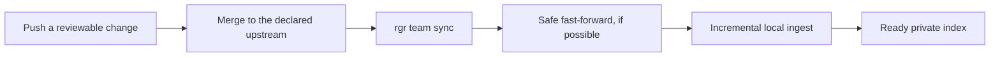

# Agent integration

Ragmir indexes the selected project files locally and gives the AI or automation you choose cited
passages through CLI or one stdio MCP server. The default `local-hash` path keeps ingestion and
retrieval offline. Core is model-agnostic, never uploads the corpus, and never calls a model itself.

For an interactive repository-aware installation, paste the canonical prompt from the
[quick-start guide](./quick-start.md) into the coding agent. It detects the package manager and
existing Ragmir state, proposes safe inferred defaults, asks for one approval, then configures and
verifies the selected clients.

Choose the handoff that matches the corpus:

| Path | What stays local | What crosses the boundary |
| --- | --- | --- |
| Preferred hosted AI | Corpus, index, and retrieval | Only returned passages, under the AI provider's data policy |
| Local AI or automation | Corpus, index, retrieval, and the consumer | Nothing, unless that consumer uses another network service |
| Ragmir Chat | Corpus, index, retrieval, and answer generation | One explicit model download during setup, then no network |

Prepare the target repository once:

```bash
rgr setup --agents claude,codex,kimi,opencode,cline
```

The canonical files live under ignored `.ragmir/`. Setup also links the selected skills into each
agent's native project directory and generates a local `.ragmir/run.cjs` MCP runner. The runner uses
the installed project binary first, then the current package installation, with a pinned npm fallback.

## Native helpers

| Agent | Generated helper |
| --- | --- |
| Claude Code | `.ragmir/claude-mcp-server.json` |
| Codex | `.ragmir/codex-mcp.toml` |
| Kimi | `.ragmir/kimi-mcp.json` |
| OpenCode | `.ragmir/opencode.jsonc` |
| Cline | `.ragmir/cline-mcp.json` |

Setup installs project-scoped native skill discovery by default. Re-run installation when you want a
different scope or copy mode:

```bash
rgr install-agent --agents codex,claude
```

Use `--scope user` only when you intentionally want a user-wide installation. Project scope is the
default. Codex skills use `.agents/skills/` for both project and user discovery. `--mode copy` is a
fallback for filesystems that cannot follow symlinks. Ragmir refuses to overwrite an unmanaged
same-name skill unless you explicitly pass `--force` after reviewing it.

## Move a frozen knowledge base to another host

Use a portable folder when an agent, automation, or server needs cited evidence but should not
receive the original project tree:

```bash
rgr portable export --output ../operations-knowledge
```

Move the complete directory to a Node.js 22 host with the platform recorded in `manifest.json`, then
verify it at the destination. The runtime and its native retrieval dependencies are embedded, so no
package-manager install or registry access is needed after transfer:

```bash
cd /srv/operations-knowledge
node bin/rgr.cjs portable verify . --json
node bin/configure.cjs --list
node bin/configure.cjs openclaw
```

For a destination path already used by agents, publish the next source revision with
`rgr portable export --output /absolute/stable/path --replace`. Ragmir verifies the new folder first
and preserves the old one as a timestamped sibling. Restart long-running agent processes after the
switch, then retire the previous folder only after a representative query succeeds.

Dedicated configuration output is available for OpenClaw, Claude, Codex, Kimi, OpenCode, and Cline.
For OpenClaw, register the generated read-only server object then probe it:

```bash
openclaw mcp set ragmir "$(node bin/configure.cjs openclaw)"
openclaw mcp doctor ragmir --probe
```

Hermes can use the generic MCP stdio configuration. n8n, CI, or a custom service can use the same MCP
contract or invoke `node bin/rgr.cjs search ... --json` with an argument array. Do not concatenate an
untrusted query into a shell command.

Load `skills/ragmir-portable` for retrieval behavior and `skills/ragmir-decision-evidence` when an
agent must compare options. The decision skill requires cited evidence, explicit inference and
unknowns, and keeps action authority in the host. A knowledge-base result never authorizes a
deployment, message, purchase, deletion, or other external side effect.

The bundle is frozen. Its launcher rejects ingest, setup, repair, upgrade, storage, source, and
deletion commands. Its MCP surface omits `ragmir_evaluate` because that operation can persist a
quality report. Replace the bundle with a new export when source knowledge changes. Raw documents
and access logs are excluded, but indexed passages are present and sensitive. See
[Portable knowledge bases](./portable-knowledge-bases.md) for the complete contents, integrity
model, runtime prerequisite, and network boundary.

## Monorepo bases

A monorepo can run one root knowledge base plus isolated bases in individual apps. From the app or
file currently in scope, run:

```bash
rgr bases --json
```

The nearest `.ragmir/config.json` is `activeId`. Use the root base for shared architecture and
cross-app decisions; use the nearest app base for app-specific questions. Generated MCP helpers set
`RAGMIR_PROJECT_ROOT` explicitly. Nested bases also receive deterministic names such as
`ragmir-apps-web`, avoiding collisions with the root `ragmir` server. If an agent can see more than
one Ragmir server, call `ragmir_status` and verify `knowledgeBaseId` before retrieval. Keep evidence
from different bases labeled rather than silently merging citations.

## Team knowledge bases

Ragmir keeps one private local index per developer. For a Git-backed team, the current branch
upstream is the only declared authority. Configure it once, then use one command:

```bash
rgr team sync
```

### The everyday workflow



1. A developer pushes a branch and opens or updates a pull request (or merge request).
2. The team reviews and merges it into the declared upstream branch.
3. Other developers run `rgr team sync`; source updates and local reindexing happen together.

Git already shows what changed and where review is needed. Ragmir does not add labels, snapshots,
or another source of truth to this normal path.

| Result | What Ragmir does |
| --- | --- |
| `current` | Keeps the checked-out sources and local index because they are already aligned. |
| `updated` | Fetches only the declared upstream, fast-forwards safely, then ingests changed sources. |
| Needs action | Leaves Git history and the active index untouched, then explains the first next step. |

The automatic path fetches only that upstream and fast-forwards only when the worktree is clean,
the local branch has no unpublished commits, and history has not diverged. It never stashes, resets,
rebases, creates a merge commit, chooses another branch, or deletes the active index.

### Choose the sync mode

| Need | Command | Effect |
| --- | --- | --- |
| Normal team update | `rgr team sync` | Safely update from upstream and ingest incrementally. |
| Keep Git updates manual | `rgr team sync --no-pull` | Fetch and compare, but do not change the checked-out branch. |
| Preview only | `rgr team sync --check` | Report Git and index state without changing either one. |
| Work offline | `rgr team sync --no-fetch` | Use cached Git state and local sources only. |
| Enforce in automation | `rgr team sync --strict --json` | Return a typed report and fail unless freshness and readiness are proven. |

Dirty, ahead, diverged, detached, untracked, or no-upstream branches are never rewritten. A failed
fetch keeps the last valid index and marks upstream freshness as unverified. A failed ingestion also
preserves the previous validated index. Resolve the Git state through the normal pull-request or
merge-request workflow, then run the same command again.

The ignored `.ragmir/config.json` remains local. If every workstation needs the exact same source
contract, version a reviewed template in the repository and apply it during setup. `rgr team sync`
synchronizes tracked sources through Git; it does not commit or distribute private Ragmir state.

### When exact drift diagnosis is genuinely needed

Snapshots are an advanced fallback for a non-Git authority, such as Drive, or for a specific
configuration and per-file investigation. They are not a prerequisite for ordinary Git teams.

<details>
<summary>Compare two authorized snapshots without sharing source text</summary>

On one authorized workstation:

```bash
rgr team snapshot --label local --output .ragmir/team/local.json
```

Share that file only with teammates authorized for the corpus. It contains relative paths,
SHA-256 checksums, readiness, version, and index settings, never source text or an absolute project
path. On another workstation:

```bash
rgr team compare .ragmir/team/local.json --local-label peer
```

The result distinguishes configuration drift, local-only files, peer-only files, and changed files.
It provides ordered commands for readiness, upgrade, ingestion, or rebuild work. Use the declared
Drive revision, team folder, or Git commit as the authority, then compare fresh snapshots until
`status=synchronized`. Operational readiness and privacy review are independent: a matching index
with local extractor or permission warnings remains synchronized, while the comparison exposes
per-side security advisory counts and recommends `rgr security-audit`. Do not rebuild a healthy
index only to clear an advisory. Existing v2.19 snapshots remain compatible.

Use stable directory or glob contracts instead of rewriting local config from files found on one
machine. The lower-level `corpusFingerprint` returned by `rgr status --json`, `status()`, or
`ragmir_status` remains useful for a quick equality check. Matching values prove the same indexed
relative paths and source bytes only when both reports are ready with no missing or stale files.
Use `rgr team compare` only when values differ and the team needs the exact cause.

Use `sourceFingerprintMode: "strict"` when a synchronization tool can preserve file metadata while
replacing its content. Older manifests return a `null` fingerprint until the next successful
ingestion.

Do not synchronize `.ragmir/storage/` between active writers. A team bootstrap can call
`initProject`, `addSourceEntries`, and `syncTeamKnowledge`; each workstation still owns its index.

</details>

### Agent behavior on team drift

An agent using the bundled Ragmir skill should run `rgr team sync --json` before relying on a
Git-backed shared knowledge base. When `synchronized` is false, it should warn the user in the
user's language, present the first recommended action, and continue only with an explicit note when
the last valid local index may be older than upstream. It must never resolve Git history, stash,
reset, rebase, or overwrite source files. Snapshot comparison remains the advanced fallback for an
authorized non-Git source or exact drift investigation.

## Use Ragmir through MCP

The server exposes `ragmir_status`, `ragmir_route_prompt`, `ragmir_search`, `ragmir_ask`,
`ragmir_research`, `ragmir_expand`, `ragmir_audit`, `ragmir_evaluate`, `ragmir_usage_report`, and
`ragmir_security_audit`.

It also exposes two bounded resources:

| Resource | Use |
| --- | --- |
| `ragmir://context` | Active base identity, readiness, freshness, coverage, and available operations. |
| `ragmir://sources` | Manifest source coverage, skipped-file counts, and index drift, with a budget-derived file preview returned without scanning chunks. |

Read `ragmir://context` first when the client supports resources. This gives an agent enough context
to choose the next operation without chaining status, doctor, and audit calls. Totals in
`ragmir://sources` stay complete even when detail lists are truncated.
The TypeScript `sources({ offset, limit })` method can request later pages directly from the
manifest file snapshot without materializing the complete source list; its default page remains 50
files.

### Retrieve bounded evidence

MCP search, ask, and research start with at most three compact document citations when `topK` and
`compact` are omitted; research may add up to three code matches. Pass one returned citation to
`ragmir_expand` when the agent needs the exact chunk or a
bounded neighbor window. Use `compact: false` with an explicit `topK` only when the complete
retrieval payload is required. CLI output is unchanged and needs an explicit `--compact` flag.
Search, ask, research, expansion, audit, and evaluation
accept `maxBytes`. Variable-size tool and resource JSON is bounded by `mcpMaxOutputBytes` and an
absolute 1 MiB server ceiling; every response has an explicit full or summary schema. Responses
stay parseable, while `_meta["ragmir/output"]` reports the active budget, returned bytes, and
truncation.
Budget pressure selects a typed summary with exact scalar values, previews, and omission counters;
it never shortens identifiers, paths, or warnings in place. Search always retains the best citation
when one exists. The server also applies the budget before choosing retrieval depth, source page
size, audit detail, and returned evaluation case details, while keeping aggregate metrics complete.
`ragmir_ask` returns cited evidence, not a model generated answer. A cloud agent can receive returned
passages, so choose that handoff only when it matches the corpus's confidentiality requirements.

<details>
<summary>Advanced: response contracts, safety annotations, and server lifecycle</summary>

Every tool advertises non-destructive behavior to compatible clients. Search, ask, research, and
evaluation conservatively advertise open-world behavior because explicitly enabled semantic models
may download public weights. The pure prompt router, security audit, and usage report also advertise
read-only, idempotent behavior. Other tools conservatively do not because they can initialize
ignored local state or append metadata-only access logs. `ragmir_evaluate` accepts only an existing
project-relative golden file; absolute paths, traversal, and symlinks that escape the project are
rejected. Strict mode returns that relative path, replaces evaluation failures with a generic
message, and masks configured model, storage, source, and access-log paths in diagnostic responses.
The server also publishes concise protocol instructions for the context, compact retrieval,
single-citation expansion, and read-only evidence flow, so compatible clients do not need to infer
the sequence from tool names.

The generated helpers cover Claude Code, Codex, Kimi, OpenCode, and Cline. Other tools can consume
the same evidence through the CLI, TypeScript API, or any compatible MCP client. Hermes, n8n
workers, CI jobs, and internal applications do not require a dedicated Ragmir model integration.

Embedding applications can call `createMcpServer(cwd)` to register a caller-owned transport, or
`connectMcpServer(transport, cwd)` to connect it and receive a closeable server handle. The standard
`serveMcp(cwd)` helper remains the simplest local stdio entry point. A server lazily reuses one
`RagmirClient` per effective configuration for its pinned project root, refreshes it after
configuration changes, and closes the active client when the server or transport closes. Each MCP
request resolves configuration once. Request cancellation reaches retrieval operations and bounded
resource handlers. Native
filesystem and LanceDB calls that cannot receive an `AbortSignal` directly are checked immediately
before and after the call. Ragmir does not open an HTTP port; applications that expose a network
transport own its authentication and
authorization boundary.

</details>

## Verify

```bash
rgr doctor
rgr status --json
rgr bases --json
rgr search "known phrase" --compact
```

Doctor reports runner verification, native agents discovered, and integration warnings separately
from retrieval readiness.

If the client cannot set a working directory, launch the server with `RAGMIR_PROJECT_ROOT=/absolute/path/to/project`.
